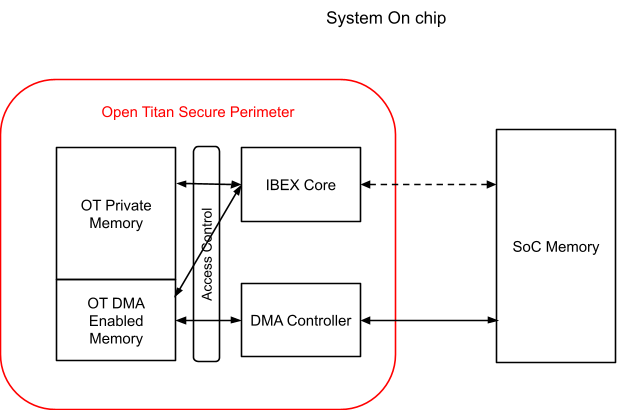

# Integrated OpenTitan: DMA Controller (secure\_dmac\_spec)

Contributor: [*Neeraj Upasani*](mailto:neeraj@opentitan.org)

Reviewer: [*Pirmin Vogel*](mailto:vogelpi@opentitan.org) [*Andreas
Kurth*](mailto:adk@opentitan.org) [*Michael
Schaffner*](mailto:msf@opentitan.org)
[*technical-committee@opentitan.org*](mailto:technical-committee@opentitan.org)

Last Update: 2023-04-24

Approved by TC: 2023-04-25

Status: Approved v1.0

## Introduction

### Scope

Document a proposal for the secure DMA controller for the Integrated
OpenTitan project

### Document Organization

### Glossary

|                                      |                                                                 |
|--------------------------------------|-----------------------------------------------------------------|
| Term                                 | Description                                                     |
| PCIe                                 | PCI Express                                                     |
| CXL                                  | Compute Express Link                                            |
| MCTP                                 | Management Component Transport Protocol                         |
| SPDM                                 | Security Protocol and Data Model                                |
| CMA                                  | Component Measurement and Attestation                           |
| [*DMTF*](https://www.dmtf.org/about) | formerly known as the Distributed Management Task Force         |
| OT                                   | OpenTitan                                                       |
| RoT                                  | Root Of Trust                                                   |
| CTN                                  | ConTrol Network                                                 |
| SoC                                  | System On Chip                                                  |
| IOMMU                                | Input Output Memory Management Unit |
| ECR                                  | Engineering Change Request                                      |
| ECN                                  | Engineering Change Notification                                 |

### References

<table>
<tbody>
<tr class="even">
<td>OpenTitan Documentation </td>
<td><a href="https://docs.opentitan.org/"><em>https://docs.opentitan.org/</em></a></td>
</tr>
<tr class="odd">
<td>PCIe Specification</td>
<td><a href="https://members.pcisig.com/wg/PCI-SIG/document/18363"><em>PCI Express</em></a></td>
</tr>
<tr class="even">
<td>CXL Specification</td>
<td><a href="https://www.computeexpresslink.org/download-the-specification"><em>Compute Express Link</em></a></td>
</tr>
<tr class="odd">
<td>SPDM</td>
<td>
<a href="https://www.dmtf.org/dsp/DSP0274"><em>https://www.dmtf.org/dsp/DSP0274</em></a>

CMA requires SPDM Version 1.0 or above
</td>
</tr>
<tr class="even">
<td>SPDM-MCTP</td>
<td><a href="https://www.dmtf.org/dsp/DSP0275"><em>https://www.dmtf.org/dsp/DSP0275</em></a></td>
</tr>
<tr class="odd">
<td>Secured SPDM</td>
<td><a href="https://www.dmtf.org/dsp/DSP0277"><em>https://www.dmtf.org/dsp/DSP0277</em></a></td>
</tr>
</tbody>
</table>

### Version History

<table>
<tbody>
<tr class="odd">
<td>Version</td>
<td>Description</td>
<td>Authors</td>
</tr>
<tr class="even">
<td>0.1</td>
<td>Initial version</td>
<td>
 <a href="mailto:neeraj@rivosinc.com"><em>Neeraj Upasani</em></a>

(Rivos Inc)
</td>
</tr>
<tr class="odd">
<td>0.3</td>
<td>
Register Updates; 

Use case Updates
</td>
<td>
<a href="mailto:neeraj@rivosinc.com"><em>Neeraj Upasani</em></a>

(Rivos Inc)
</td>
</tr>
</tbody>
</table>

## Overview

The integrated version of OpenTitan Root-Of-Trust may provide security
services to the SoC such as:

-   Encryption or decryption of data blobs
-   Cryptographic hashing of data blobs
-   Key derivation
-   Random seed generation service
-   Public Key (PK) signing
-   PK verification
-   Root of Trust for Measurement, Reporting and Storage
-   Secure Firmware update
-   Access to secure storage
-   Mutual authentication / attestation services
-   SoC security monitoring / book-keeping services
-   Debug authentication / unlock service

Such operations require movement of bulk data from SoC / system memory
to the OpenTitan private memory and vice-versa. The Secure DMA
controller block shall provide OpenTitan with the ability to move data
blobs securely in and out of the OpenTitan memory while offloading the
Ibex core to focus on security critical tasks. The secure DMA provides
an hardware isolation layer between OpenTitan and the rest of the SoC.
It provides the hardware enforcement of security properties through well
defined isolation & access control techniques, hardware based checking
and other protection mechanisms. Note that depending upon use case, it
is expected that the SoC provides proper security mechanisms for code /
data protections such as access control mechanisms, encrypted
(w/integrity protection) memory regions etc.

An example scenario where secure DMA could potentially be used is
firmware controlled secure boot operation:

-   Configure DMA to move signed firmware image (or a manifest) into OT
    DMA enabled memory
-   OT performs digital cryptographic hash operation and signature-based
    verification of the firmware image / manifest.
-   If digital signature verification passes, DMA is configured to move
    the firmware to a protected location within the SoC secured by
    access control to prevent further modification
-   Enable other firmware based processing elements to boot from this
    secure location.

Additional efficiency benefits can be derived by supporting optional
smart inline operations such as on-the-fly hashing, on-the-fly
encryption etc within the DMA controller. Inline operations would
additionally remove size restrictions on data to be hashed and could
keep data that gets hashed or encrypted physically confidential. Inline
operations are a potential extension for a next generation of the DMA
Controller and are described in more detail in [*Extension: Inline
Operations*](#extension-inline-operations).

The DMA controller shall be used in conjunction with the newly defined
[*OpenTitan mailbox interface*](): The Ibex CPU reads
and parses pre-defined mailbox command objects, sanitizes DMA parameters
(such as the desired DMA operation and SoC memory addresses) from an
object, and configures the DMA controller accordingly. Note that
addresses here are treated as IO virtual addresses. There deliberately
is no hardware interface that would allow the SoC to control the DMA
Controller. Please refer to the ‘[*Access to SoC address
space*]()’
document for more details on handling of SoC level memory operations.

## Secure DMA Controller

### Defining Relevant Memory Regions

|                       |     |
|-----------------------|-----|
| OT Private Memory     | Memory within the OpenTitan RoT secure perimeter
|                       | This memory is allocated to the OT components like Ibex core for its secure code execution and data storage memory |
| OT DMA Enabled Memory | Memory within the OpenTitan RoT secure perimeter. |
|                       | This memory is allocated as a staging area while moving data using the DMA controller |
|                       | DMA operation is allowed to touch this memory |
|                       | DMA controller shall provide configuration range registers to map OT internal memory as DMA enabled memory |
| SoC memory            | Any memory outside the OpenTitan RoT secure perimeter |
|                       | This memory may be untrusted from the OT perspective or may be included in its trust boundary for certain cases by leveraging SoC defined security access control enforcement |

### Mode of operation

The DMA is envisioned to operate in two main modes:

1.  Data movement (bulk data movement or register read / write
    operations). May perform additional smart in-line operations during
    data movement beyond simple copy
2.  Hardware handshake mode where the DMA controller may be used to fill
    up or drain out hardware FIFO data for low speed IO peripherals (or
    other peripherals) that support it.

#### Generic DMA operation

Mode of operation & interactions with components considered external to
the OT Trusted Compute Boundary

-   External agents (e.g. System Host or other SoC Controllers) may
    request certain security services from OpenTitan such as encryption,
    digital signing etc. Such an operation is requested using the
    Mailbox interface and may involve bulk data movement

    -   Please refer to the [*mailbox specification*](https://opentitan.org/book/hw/ip/mbx/index.html)
        for further details on the mailbox structure.

-   Through the mailbox interface following information may be passed:

    -   Source address pointer & Address space Identifier for the source
        address.

    -   Destination address pointer & Address space Identifier of the
        destination address

    -   Size of the data object to be moved

    -   Opcode - Type of any optionally supported operation e.g.
        Cryptographic hash

    -   \<anything else TBD\>

-   OT firmware parses the command object passed through the mailbox.
-   OT firmware sanitizes mailbox objects as required
-   OT firmware allocates DMA enabled memory space for the data movement
    as needed
-   OT firmware configures DMA source address register & the
    corresponding address space Identifier
-   OT firmware configures DMA destination address register &
    corresponding address space Identifier
-   OT firmware completes other configurations such as operation size,
    OPCODE of any additional inline operations requested (e.g.
    cryptographic hash calculation of data blob being moved)
-   OT firmware triggers the DMA operation
-   DMA hardware performs appropriate address and configuration checks
    to enforce the defined security and access control properties
-   OT firmware chooses to poll for status registers until operation
    completes or waits for completion interrupt from the DMA controller.

***Notes***:

-   *Please refer to the Integrated [*OpenTitan: Access to SoC address space document*]()
    for more details on the address spaces (OT internal, Control
    Register address space, System Address Space), corresponding
    identifiers & any involved address translation. Note that the
    address pointer may be an IO Virtual Address (IOVA) when the address
    space identifier is the system address space*
-   *As mentioned in the aforementioned document, the SoC memory may be
    subject to additional protection schemes - either using
    cryptographic techniques or access control based isolation
    techniques*
-   *External agents **shall not have direct access **to any addressable
    regions within OT address space other than the mailbox registers*
-   *The DMA controller shall support hardware range registers to
    configure the address range for DMA enabled OT memory. Range
    registers may be configured by OT firmware at boot time and locked
    from further modification until next reset. Existing specifications
    and implementations of range registers, such as for PMP, may be
    reused, although striking a balance between feature complexity and
    consolidation is needed.*
-   *DMA controller shall perform address checks against this configured
    range*
-   *Detailed list of hardware checks performed by the DMA controller
    covered under* [*DMAC HW Enforced Security Checks*](#dmac-hw-enforced-security-checks)
-   *Note that the DMA enabled memory may be a physically separate SRAM
    structure or a partitioned and access controlled region of the OT
    SRAM memory*

#### Hardware handshake based DMA operation

DMA based hardware handshake is used to offload the receiving data from
or sending data to a low-speed I/O FIFO (LSIO FIFO). The low speed
device must provide a trigger (or interrupt) signal to initiate data
transfer. (A dedicated trigger/interrupt signal was selected instead of
a polling mechanism to keep the on-chip network to which the DMA
controller control interface is attached clean of many repeated
transactions. The number of interrupt signals is expected to be low,
e.g., 2 or 3.)

Following information regarding the low speed IO peripheral will be know
to firmware at build time and set in the DMAC registers to configure a
hardware handshake DMA operation

**Receiving data from LSIO**

-   [*Source address*](#dmac-source-address-low-register): address of the low speed IO
    receive FIFO read out register
-   [*Destination address*](#dmac-destination-address-low-register): address to the memory
    buffer where received data is placed
-   [*Address space ID*](#dmac-address-space-register): (OT Internal, CTN or System)

    -   Source ASID: Specify the address space in which the LSIO FIFO is
        visible

    -   Destination ASID: Specify the address space in which the
        destination buffer resides

-   [*Total Size*](#dmac-total-size-register): Size of the data object to be popped
    from the FIFO (equivalent to the number of reads from the FIFO per
    interrupt times the FIFO read data width)
-   [*Transfer Size*](#dmac-transfer-size-register): Size of each transaction
    (equivalent to FIFO read data width)
-   [*Limit register*](#dmac-memory-buffer-limit-low-register): Marks the end of the buffer used
    to load ‘total size’ worth of data payloads if memory buffer
    auto-increment feature is used. DMAC shall set an overflow
    indication if the buffer limit is reached.
-   [*DMAC Control register*](#dmac-control-register)

    -   Opcode: Type of operation requested. Typically set to copy
        operation in case of hardware handshake mode of operation

    -   Hardware handshake enable = 1

    -   Data Direction = 0 (receive)

    -   FIFO address auto-increment enable: If set, consecutive
        ‘transfer size’ worth of data chunks are popped from the FIFO
        using consecutive register addresses. If not enabled,
        consecutive data chunks are popped by repeatedly reading the
        same register address.

    -   Data buffer Auto-increment Enable: If set to 1, data shall be
        loaded into consecutive buffer segments in memory, where each
        segment is equivalent to ‘total size’ worth of data. To
        prepare for the next data buffer segment, [*Destination
        address*](#dmac-destination-address-low-register) register is incremented by ‘[*Total
        Size*](#dmac-total-size-register)’ once an equivalent amount of data is
        emptied from the FIFO & written to the buffer segment. If auto
        increment feature is not set, then the memory buffer gets
        overwritten each time the low speed device triggers the DMA
        based hardware handshake operation

    -   Go = 1 to start the operation

-   DMA engines start listening to input interrupt
-   Low speed IO peripheral FIFO asserts interrupt once FIFO reaches a
    certain threshold
-   The DMA engine reads the ‘total size’ number of bytes from the
    pointer in source address register (receive FIFO) and places them in
    the destination buffer. Note that width of each read is per the
    ‘transfer size’ setting.
-   ***Note**: assumption is the peripheral lowers input once FIFO is
    cleared. No explicit clearing necessary*
-   The DMA engine increments the source and destination address
    register if respective auto-increment enable is set.
-   DMA engine waits for the interrupt to get asserted again (i.e. waits
    for FIFO to be filled)

**Sending data to LSIO**

-   [*Source address*](#dmac-source-address-low-register): Pointer to the head of the
    memory buffer
-   [*Destination address*](#dmac-destination-address-low-register): pointer to the FIFO
    register
-   [*Address space ID*](#dmac-address-space-register): (OT Internal, CTN or System)

    -   Source ASID: Specify the address space in which the source
        buffer resides

    -   Destination ASID: Specify the address space in which the LSIO
        FIFO is visible

-   [*Total Size*](#dmac-total-size-register): Size of the data object to be pushed
    into the FIFO
-   [*Transfer Size*](#dmac-transfer-size-register): Write Data width of the LSIO FIFO
    register. Each write transaction is equal to this size
-   [*Limit register*](#dmac-memory-buffer-limit-low-register): Marks the end of the memory
    buffer used to read ‘total size’ worth of data segments if
    auto-increment feature is used. DMAC shall set an overflow
    indication if the buffer limit is reached.
-   [*DMAC Control register*](#dmac-control-register)

    -   Opcode: Type of operation requested. Typically set to copy
        operation in case of hardware handshake mode of operation

    -   Hardware handshake enable = 1

    -   Data Direction = 1 (send)

    -   FIFO address auto-increment enabled if consecutive ‘transfer
        size’ worth of data chunks are pushed to the FIFO using
        consecutive register addresses. If not enabled, consecutive
        data chunks are pushed by repeatedly writing the same register
        address.

    -   Data buffer Auto-increment Enable: If set to 1, data shall be
        read from consecutive buffer spaces, each equivalent to ‘total
        size’ worth of data. To prepare for the next data buffer
        segment [*Source address*](# dmac-source-address-low-register) register is
        incremented by ‘[*Total Size*](#dmac-total-size-register)’ once the
        equivalent amount of data is written to the FIFO. If auto
        increment feature is not set, then the same memory buffer
        segment gets read each time an interrupt triggers the DMA
        based hardware handshake operation

    -   Go = 1 to start the operation

-   DMA engines start listening to input interrupt
-   Low speed IO peripheral FIFO asserts interrupt once FIFO reaches a
    certain ‘almost empty’ threshold
-   The DMA engine reads the total size number of bytes from the source
    address register (memory) and writes them into the FIFO register.
    Width of each write is equal to the transfer size setting
-   ***Note**: assumption is the peripheral lowers ‘almost empty’
    interrupt once FIFO is filled. No explicit clearing necessary*
-   The DMA engine increments the source and destination address
    register if respective auto-increment enable is set.
-   DMA engine waits for the interrupt to get asserted again (i.e. waits
    for FIFO to be almost empty)

### Security Considerations

The DMA controller provides the following security value

-   Separation of roles and responsibilities

    -   Ibex core involved in control / configuration, security
        monitoring operations

    -   DMA controller involved in data movement & corresponding
        hardware enforced checks

-   DMA engine acts as the boundary between OT secure components & the
    SoC for data movement
-   While moving data from the SoC to OpenTitan, the DMA controller
    protects the Ibex core by staging the moved data into a DMA enabled
    memory location and providing an opportunity to perform additional
    security checks on it, before it is touched by the Ibex core.
-   Similarly, while moving data out of the OT secure perimeter,
    provides an opportunity to inspect it for information leakage within
    the DMA enabled memory, prior to moving it out of the secure
    perimeter.
-   A read to an SoC address may have side effects causing the operation
    to hang. Using the Ibex core directly to perform such a read
    operation may end up hanging the core. Using the DMA controller to
    perform such reads shields the Ibex core from such availability
    issues. The DMA controller must ensure that problems such as hanging
    transactions on the SoC interface do not lead to problems on any
    OpenTitan-internal interfaces.

Note that to ensure secure movement of data, following assumption hold
true:

-   DMA Controller configuration shall be under OpenTitan firmware (Ibex
    core) control only.
-   External agents to the OpenTitan secure boundary *shall not* have
    access the DMA registers
-   Following restrictions to data movement are observed and enforced by
    the DMA controller

<table>
<tbody>
<tr class="odd">
<td>
From →

To ↓
</td>
<td>OT Private Memory</td>
<td>OT DMA Memory</td>
<td>SoC Memory</td>
</tr>
<tr class="even">
<td>OT Private Memory</td>
<td>✔</td>
<td>✔</td>
<td>❌</td>
</tr>
<tr class="odd">
<td>OT DMA Memory</td>
<td>✔</td>
<td>✔</td>
<td>✔</td>
</tr>
<tr class="even">
<td>SoC Memory</td>
<td>❌</td>
<td>✔</td>
<td>✔</td>
</tr>
</tbody>
</table>

#### DMAC HW Enforced Security Checks

-   DMA enabled memory range registers are configured & locked prior to
    starting any DMA operation
-   If the configured source address space ID is SOC (CTN or System) and
    destination address space ID is OT internal, then destination
    address pointer must lie within the DMA enabled memory range
-   If the configured destination address space ID is SOC (CTN or
    System) and source address space ID is OT internal, then source
    address pointer must lie within the DMA enabled memory range
-   If source (or destination) address space ID is set to CTN, then read
    (or write transactions) are sent to CTN port only. If CTN port is
    configured to be 32 bits, then make sure that the upper 32 bits of
    the source (or destination) address register pointer are all zeroes
-   If source (or destination) address space ID is set to OT Internal,
    then read (or write transactions) are sent to OT internal port only.
    Make sure that the upper 32 bits of the source (or destination)
    address register pointer are all zeroes
-   If source (or destination) address space ID is set to System, then
    read (or write transactions) are sent to system port only. Full 64
    bits of the source (or destination) address pointer is available.

### DMA Controller Configuration Registers

#### DMAC Source Address Low Register

<table>
<tbody>
<tr class="odd">
<td><strong>Register</strong></td>
<td><strong>Width</strong></td>
<td><strong>Bit Definition</strong></td>
<td><strong>Notes</strong></td>
</tr>
<tr class="even">
<td>Source Address </td>
<td>32 bits</td>
<td>Source Address Low [31:0]</td>
<td>
Source address pointer. 

Target address space is based on the source Address Space ID register setting. Data is read <em><strong>from</strong></em> this location in a copy operation. 

May be an IO Virtual address in case the target address space points to the System address space. 
</td>
</tr>
</tbody>
</table>

#### DMAC Source Address High Register

<table>
<tbody>
<tr class="odd">
<td><strong>Register</strong></td>
<td><strong>Width</strong></td>
<td><strong>Bit Definition</strong></td>
<td><strong>Notes</strong></td>
</tr>
<tr class="even">
<td>Source Address </td>
<td>32 bits</td>
<td>Source Address High [63:32]</td>
<td>
Source address pointer. 

Target address space is based on the source Address Space ID register setting. Data is read <em><strong>from</strong></em> this location in a copy operation. 

May be an IO Virtual address in case the target address space points to the System address space. 
</td>
</tr>
</tbody>
</table>

#### DMAC Destination Address Low Register

<table>
<tbody>
<tr class="odd">
<td><strong>Register</strong></td>
<td><strong>Width</strong></td>
<td><strong>Bit Definition</strong></td>
<td><strong>Notes</strong></td>
</tr>
<tr class="even">
<td>Destination Address </td>
<td>32 bits</td>
<td>Destination Address Low [31:0]</td>
<td>
Destination address pointer. 

Target address space is based on the Destination Address Space ID register setting. Data is written <em><strong>to</strong></em> this location in a copy operation. May be an IO Virtual address in case the target address space points to the System address space. 
</td>
</tr>
</tbody>
</table>

#### DMAC Destination Address High Register

<table>
<tbody>
<tr class="odd">
<td><strong>Register</strong></td>
<td><strong>Width</strong></td>
<td><strong>Bit Definition</strong></td>
<td><strong>Notes</strong></td>
</tr>
<tr class="even">
<td>Destination Address </td>
<td>32 bits</td>
<td>Destination Address High [63:32]</td>
<td>
Destination address pointer. 

Target address space is based on the Destination Address Space ID register setting. Data is written <em><strong>to</strong></em> this location in a copy operation. May be an IO Virtual address in case the target address space points to the System address space. 
</td>
</tr>
</tbody>
</table>

#### DMAC Address Space Register

<table>
<tbody>
<tr class="odd">
<td><strong>Register</strong></td>
<td><strong>Width</strong></td>
<td><strong>Bit Definition</strong></td>
<td><strong>Notes</strong></td>
</tr>
<tr class="even">
<td rowspan="3">
Address Space ID

(ASID)
</td>
<td rowspan="3">
32 bits
</td>
<td>Source ASID[1:0]</td>
<td>
Target Address space that the source address pointer refers to

<strong>00:</strong> 

OpenTitan 32 bit internal bus

<strong>01:</strong> 

SoC control register address bus using 32 bit (or 64 bits if configured by an SoC) CTN port. 

<strong>10:</strong> 

SoC system address bus using 64 bit SYS port

<strong>11:</strong> OT External Flash address space
</td>
</tr>
<tr class="odd">
<td>Destination ASID[3:2]</td>
<td>
Target Address space that the destination address pointer refers to

<strong>00:</strong> 

OpenTitan 32 bit internal bus

<strong>01:</strong> 

SoC control register address bus using 32 bit (or 64 bits if configured by an SoC) CTN port. 

<strong>10:</strong> 

SoC system address bus using 64 bit SYS port

<strong>11:</strong> Reserved
</td>
</tr>
<tr class="even">
<td>Reserved [31:4]</td>
<td></td>
</tr>
</tbody>
</table>

#### DMAC DMA Enabled Memory Range Base Register

|                                   |           |                    |                                                                                                    |
|-----------------------------------|-----------|--------------------|----------------------------------------------------------------------------------------------------|
| **Register**                      | **Width** | **Bit Definition** | **Notes**                                                                                          |
| DMA Enabled Memory Range Register | 32 bits   | Base \[31:0\]      | Base Address to mark the start of the DMA enabled memory range within the OT internal memory space |

#### DMAC DMA Enabled Memory Range Limit Register

|                                   |           |                    |                                                                                            |
|-----------------------------------|-----------|--------------------|--------------------------------------------------------------------------------------------|
| **Register**                      | **Width** | **Bit Definition** | **Notes**                                                                                  |
| DMA Enabled Memory Range Register | 32 bits   | Limit \[31:0\]     | Limit to mark the end of the DMA enabled kmemory range within the OT internal memory space |

#### DMAC Range Lock Register

<table>
<tbody>
<tr class="odd">
<td><strong>Register</strong></td>
<td><strong>Width</strong></td>
<td><strong>Bit Definition</strong></td>
<td><strong>Notes</strong></td>
</tr>
<tr class="even">
<td rowspan="2">Range Register Lock Register</td>
<td rowspan="2">32 bits</td>
<td>Unlock [3:0]</td>
<td>
Default Value = MuBi4True, 
i.e. unlocked @ reset

Set by firmware to zero to lock the DMA Enabled memory range configuration registers from further modification.

This bit, once set, can be cleared only upon a reset event 
</td>
</tr>
<tr class="odd">
<td>Reserved [31:4]</td>
<td></td>
</tr>
</tbody>
</table>

#### DMAC Total Size Register

<table>
<tbody>
<tr class="odd">
<td><strong>Register</strong></td>
<td><strong>Width</strong></td>
<td><strong>Bit Definition</strong></td>
<td><strong>Notes</strong></td>
</tr>
<tr class="even">
<td>Total Data Size </td>
<td>32 bits</td>
<td>Data Size[31:0]</td>
<td>
Total Size (in bytes) of the data blob involved in data movement

<em>Minimum: 1 bytes</em>

<em>Maximum: May be restricted to a maximum pre-defined size based on OT DMA enabled memory space allocation</em>

Works in conjunction with Transfer size register below 
</td>
</tr>
</tbody>
</table>

#### DMAC Transfer Size Register

<table>
<tbody>
<tr class="odd">
<td><strong>Register</strong></td>
<td><strong>Width</strong></td>
<td><strong>Bit Definition</strong></td>
<td><strong>Notes</strong></td>
</tr>
<tr class="even">
<td>Transfer Size </td>
<td>2 bits</td>
<td>Transaction size Size[1:0]</td>
<td>
Denotes the size of each transaction that the DMAC shall issue during the data movement.

Multiple transactions of transfer size each will be issued until total size number of bytes are reached

11: Reset Default option - 4 bytes

10: Three bytes per transaction

01: Two bytes per transaction

00: 1 byte per transaction

<em>Note: 
- Firmware may need to set a different value if a receiving IP supports a read / write transaction size that is less than 1 DWORD.</em>

<em>- This does not affect the wrap-around mechanism.</em>
</td>
</tr>
</tbody>
</table>

#### DMAC Memory Buffer Limit Low Register

<table>
<tbody>
<tr class="odd">
<td><strong>Register</strong></td>
<td><strong>Width</strong></td>
<td><strong>Bit Definition</strong></td>
<td><strong>Notes</strong></td>
</tr>
<tr class="even">
<td>Memory buffer limit register</td>
<td>32 bits</td>
<td>Address Limit Low [31:0]</td>
<td>
Limit address configuration. Used in conjunction with the address auto-increment mode for hardware handshake operation to generate an interrupt when buffer address reaches this value

<em>This field is considered if and only if DMAC Control Register.Auto-increment Enable[7:7]</em> bit is set
</td>
</tr>
</tbody>
</table>

#### DMAC Memory Buffer Limit High Register

<table>
<tbody>
<tr class="odd">
<td><strong>Register</strong></td>
<td><strong>Width</strong></td>
<td><strong>Bit Definition</strong></td>
<td><strong>Notes</strong></td>
</tr>
<tr class="even">
<td>Memory buffer limit register</td>
<td>32 bits</td>
<td>Address Limit High [63:32]</td>
<td>
Limit address configuration. Used in conjunction with the address auto-increment mode for hardware handshake operation to generate an interrupt when buffer address reaches this value

<em>This field is considered if and only if DMAC Control Register.Auto-increment Enable[7:7]</em> bit is set
</td>
</tr>
</tbody>
</table>

#### DMAC Memory Buffer Almost Limit Threshold Low Register

<table>
<tbody>
<tr class="odd">
<td><strong>Register</strong></td>
<td><strong>Width</strong></td>
<td><strong>Bit Definition</strong></td>
<td><strong>Notes</strong></td>
</tr>
<tr class="even">
<td>Memory buffer threshold register</td>
<td>32 bits</td>
<td>Address Limit Low [31:0]</td>
<td>
Threshold for detecting that the buffer limit is approaching so as to prevent destination buffer overflow. Used in conjunction with the address auto-increment mode for hardware handshake operation to generate an interrupt when the buffer address approaches <em>close to the buffer (i.e. reaches this value)</em> address limit. Enables firmware to take appropriate action prior to reaching the final limit

<em>This field is optional. However this field is expected to be implicitly valid if DMAC Control Register.Auto-increment Enable[7:7]</em> bit is set
</td>
</tr>
</tbody>
</table>

#### DMAC Memory Buffer Almost Limit Threshold High Register

<table>
<tbody>
<tr class="odd">
<td><strong>Register</strong></td>
<td><strong>Width</strong></td>
<td><strong>Bit Definition</strong></td>
<td><strong>Notes</strong></td>
</tr>
<tr class="even">
<td>Memory buffer threshold register</td>
<td>32 bits</td>
<td>Address Limit High [63:32]</td>
<td>
Threshold for detecting that the buffer limit is approaching so as to prevent destination buffer overflow. Used in conjunction with the address auto-increment mode for hardware handshake operation to generate an interrupt when the buffer address approaches <em>close to the buffer (i.e. reaches this value)</em> address limit. Enables firmware to take appropriate action prior to reaching the final limit

<em>This field is optional. However this field is expected to be implicitly valid if DMAC Control Register.Auto-increment Enable[7:7]</em> bit is set
</td>
</tr>
</tbody>
</table>

#### DMAC Control Register

<table>
<tbody>
<tr class="odd">
<td><strong>Register</strong></td>
<td><strong>Width</strong></td>
<td><strong>Bit Definition</strong></td>
<td><strong>Notes</strong></td>
</tr>
<tr class="even">
<td rowspan="11">DMAC Control </td>
<td rowspan="11">32 bits</td>
<td>Reserved [1:0]</td>
<td>Reserved bits</td>
</tr>
<tr class="odd">
<td>Opcode[5:2]</td>
<td>
Defines the type of DMA operations

0: Copy Operation

Simple copy from source to destination

1: Hash Operation (algorithm SHA2-256)

Perform inline hash operation using the specified algorithm

2: Encrypt (AES-GCM)

3: Decrypt (AES-GCM)

4: ALU Ops (ADD, MUL, etc) 

<em><strong>Note </strong>that the Copy operation is a basic operation that needs to be supported.</em>

<em>Other operations are optional capabilities that may be included via design time options.</em>
</td>
</tr>
<tr class="even">
<td>Hardware handshake Enable [6:6]</td>
<td>
Enable hardware handshake mode

Used to push / pop FIFOs to / from low speed IO peripherals receiving data e.g. I3C receive buffer 
</td>
</tr>
<tr class="odd">
<td>Memory Buffer Auto-increment Enable[7:7]</td>
<td>
Used in conjunction with the hardware handshake mode of operation.

Auto Increments the memory buffer address register by total data size to point to the next memory buffer address.

Generate a warning (assert interrupt) if the auto-incremented address reaches the threshold set in <a href="#dmac-memory-buffer-almost-limit-threshold-low-register"><em>DMAC Memory Buffer Almost Limit Threshold Register</em></a> to prevent destination buffer overflow. Enables firmware to take appropriate action prior to reaching the limit
</td>
</tr>
<tr class="even">
<td>FIFO Auto-increment Enable[8:8]</td>
<td>
Used in conjunction with the hardware handshake mode of operation.

If set, reads/writes from/to incremental addresses for FIFO data register addresses.

Else uses the same address for subsequent transactions 
</td>
</tr>
<tr class="odd">
<td>Data Direction[9:9]</td>
<td>
Used in Conjunction with the hardware handshake enable

0: Rcv data from LSIO FIFO to mem buffer

1: Send data from mem buffer to LSIO FIFO
</td>
</tr>
<tr class="even">
<td>Interrupt Enable[10:10]</td>
<td>Assert an interrupt when done bit is set</td>
</tr>
<tr class="odd">
<td>Reserved[26:11]</td>
<td>Reserved for future use</td>
</tr>
<tr class="even">
<td>Abort[27:27]</td>
<td>
Aborts the DMA operation if this bit is set.

Sets the corresponding bit in the status register once the abort operation is complete. Any OpenTitan-internal transactions are guaranteed to complete, but there are no guarantees on the SoC interface.
</td>
</tr>
<tr class="odd">
<td>Reserved[30:28]</td>
<td></td>
</tr>
<tr class="even">
<td>GO[31:31]</td>
<td>
Trigger the DMA operation when the Go bit is set.

For normal operation, DMA engine clears the GO bit automatically after the configured operation is complete

For Hardware handshake operation, DMA engine does not auto clear the Go bit. Firmware shall clear the Go bit when it intends to stop the hardware handshake operation. When there’s an interrupt associated with the completion of an active transfer, it will get set once more after firmware has cleared the Go bit.
</td>
</tr>
</tbody>
</table>

#### DMAC Status Register

<table>
<tbody>
<tr class="odd">
<td><strong>Register</strong></td>
<td><strong>Width</strong></td>
<td><strong>Bit Definition</strong></td>
<td><strong>Notes</strong></td>
</tr>
<tr class="even">
<td rowspan="5">status</td>
<td rowspan="5">32 bits</td>
<td>Busy[0:0]</td>
<td>
DMA operation is active if this bit is set.

DMA engine clears this bit when operation is complete

This bit may be set as long as hardware handshake mode is active and triggered
</td>
</tr>
<tr class="odd">
<td>Done[1:1]</td>
<td>Configured DMA operation is complete</td>
</tr>
<tr class="even">
<td>Aborted[2:2]</td>
<td></td>
</tr>
<tr class="odd">
<td>Error[3:3]</td>
<td>Operation Error</td>
</tr>
<tr class="even">
<td>Error Code</td>
<td>TBD</td>
</tr>
</tbody>
</table>

<table>
<tbody>
<tr class="odd">
<td><strong>Register</strong></td>
<td><strong>Width</strong></td>
<td><strong>Bit Definition</strong></td>
<td><strong>Notes</strong></td>
</tr>
<tr class="even">
<td>status</td>
<td>NA bits</td>
<td>int_state[0:0]</td>
<td>
Auto-inserted by the regtool.

Please refer to the <a href="https://docs.opentitan.org/doc/rm/comportability_specification/#interrupt-handling"><em>OpenTitan Comportable interrupt definition</em></a> for further details
</td>
</tr>
</tbody>
</table>

#### DMAC Interrupt Enable Register

<table>
<tbody>
<tr class="odd">
<td><strong>Register</strong></td>
<td><strong>Width</strong></td>
<td><strong>Bit Definition</strong></td>
<td><strong>Notes</strong></td>
</tr>
<tr class="even">
<td>status</td>
<td>NA bits</td>
<td>int_enable[0:0]</td>
<td>
Auto-inserted by the regtool.

Please refer to the <a href="https://docs.opentitan.org/doc/rm/comportability_specification/#interrupt-handling"><em>OpenTitan Comportable interrupt definition</em></a> for further details
</td>
</tr>
</tbody>
</table>

#### DMAC Interrupt Test Register

<table>
<tbody>
<tr class="odd">
<td><strong>Register</strong></td>
<td><strong>Width</strong></td>
<td><strong>Bit Definition</strong></td>
<td><strong>Notes</strong></td>
</tr>
<tr class="even">
<td>status</td>
<td>NA bits</td>
<td>int_test[0:0]</td>
<td>
Auto-inserted by the regtool.

Please refer to the <a href="https://docs.opentitan.org/doc/rm/comportability_specification/#interrupt-handling"><em>OpenTitan Comportable interrupt definition</em></a> for further details 
</td>
</tr>
</tbody>
</table>

***Note*****: **

DMA requests are initiated by the system software (or SoC firmware
agent) through the appropriately defined [*DOE mailbox
objects*](#kix.9zytzm6px4vu). Completion status of the DMA operation to
the original requested is done via the DOE response object mechanism

#### DMAC Clear Status Register

<table>
<tbody>
<tr class="odd">
<td><strong>Register</strong></td>
<td><strong>Width</strong></td>
<td><strong>Bit Definition</strong></td>
<td><strong>Notes</strong></td>
</tr>
<tr class="even">
<td>status</td>
<td>NA bits</td>
<td>Clear[31:0]</td>
<td>
A write to this register &lt;Value is a don’t care&gt;

Clears the following DMA controller state:

Done Status, Error Status, Error Code, Done Interrupt 
</td>
</tr>
</tbody>
</table>

## Extension: Inline Operations

In a next generation, the DMA controller can be extended to perform
inline operations on data it is transferring. We primarily foresee
cryptographic operations, such as hashing or encryption, with three main
use cases:

1.  Encrypting or hashing data on-the-fly is faster (in terms of latency
    and throughput) than separating the data transfer from the
    cryptographic operation.
2.  Hashing data on-the-fly and only writing the resulting hash to the
    target memory

    1.  removes size restrictions on the data to be hashed, which would
        otherwise have to fit OT-internal memory, and

    2.  keeps data confidential because it is physically only accessible
        by the hashing (or encryption) engine used by the DMA
        controller.

To implement such inline cryptographic operations, there are two main
options:

1.  Instantiating dedicated cryptographic hardware modules inside the
    DMA controller.
2.  Sharing cryptographic hardware modules (such as the AES Accelerator
    or KMAC) that are already instantiated in OT over a HW application
    interface. KMAC already has such an interface.

The advantage of dedicated modules is that they can be parametrized or
even designed specifically for the needs of the DMA controller (e.g.,
high throughput, low latency, or both) and that no arbitration and load
balancing between the DMA controller and other users of the shared
modules is needed.

The advantage of shared modules is that they save area. Cryptographic
modules that are hardened against SCA and/or support a high throughput
or low latency occupy a substantial amount of area (100 kGE to multiple
hundred kGE, depending on requirements).

Shared modules are thus preferable if they can meet throughput and
latency requirements. To make this design decision, those requirements
have to be known.

## Future Considerations

SoC-Defined Attributes

The DMA controller may at some point need to be able to support
SoC-defined attributes on the transactions it generates. This is
particularly relevant for systems that define their memory into realms.
However, many of these attributes will likely be managed by an IOMMU and
other SoC components. An exception could be the T-bit for PCIe (for
confidential computing) when exposing Integrated OT as a PCIe device.

## Appendix

FIFO address auto-increment enable: If set, consecutive ‘transfer size’
worth of data chunks are popped from the FIFO using consecutive register
addresses. If not enabled, consecutive data chunks are popped by
repeatedly reading the same register address.

Data buffer Auto-increment Enable: If set to 1, data shall be loaded
into consecutive buffer segments in memory, where each segment is
equivalent to ‘total size’ worth of data. To prepare for the next data
buffer segment, *Destination address*
register is incremented by ‘[*Total Size*](#dmac-total-size-register)’
once an equivalent amount of data is emptied from the FIFO & written to
the buffer segment. If auto increment feature is not set, then the
memory buffer gets overwritten each time the low speed device triggers
the DMA based hardware handshake operation

\<---

In case of the FIFO address auto-increment enable mode is set, then the
FIFO is read / written at the same address i.e. from your example above

transfer 0 FIFO addr: 0x0 ; transfer 0 SRAM buffer addr: 0x0

transfer 1 FIFO addr: 0x0 ; transfer 0 SRAM buffer addr: 0x4

transfer 2 FIFO addr: 0x0 ; transfer 0 SRAM buffer addr: 0x8

If FIFO address auto-increment enable bit is zero, then

transfer 0 FIFO addr: 0x0 ; transfer 0 SRAM buffer addr: 0x0

transfer 1 FIFO addr: 0x4 ; transfer 0 SRAM buffer addr: 0x4

transfer 2 FIFO addr: 0x8 ; transfer 0 SRAM buffer addr: 0x8

Assuming that there are only 3 transfers in this transaction buffer
(i.e. FIFO depth is 3)

However you are setting up a load of 6 bytes

In this case if you want to preserver all the data in the SRAM buffer
(i.e. avoid overwrite of the data during the transfer 3,4,5) then need
to leverage the Data buffer Auto-increment Enable bit as well

FIFO address auto-increment enable=0 and Data buffer Auto-increment
Enable=0 then ==\> Note that *here the SRAM buffer data gets
overwritten*

transfer 0 FIFO addr: 0x0 ; transfer 0 SRAM buffer addr: 0x0

transfer 1 FIFO addr: 0x0 ; transfer 0 SRAM buffer addr: 0x4

transfer 2 FIFO addr: 0x0 ; transfer 0 SRAM buffer addr: 0x8

transfer 3 FIFO addr: 0x0 ; transfer 0 SRAM buffer addr: 0x0

transfer 4 FIFO addr: 0x0 ; transfer 0 SRAM buffer addr: 0x4

transfer 5 FIFO addr: 0x0 ; transfer 0 SRAM buffer addr: 0x8

FIFO address auto-increment enable=1 and Data buffer Auto-increment
Enable=0 then ==\> Note that *here all the SRAM buffer data gets
preserved*

transfer 0 FIFO addr: 0x0 ; transfer 0 SRAM buffer addr: 0x0

transfer 1 FIFO addr: 0x4 ; transfer 0 SRAM buffer addr: 0x4

transfer 2 FIFO addr: 0x8 ; transfer 0 SRAM buffer addr: 0x8

transfer 3 FIFO addr: 0x0 ; transfer 0 SRAM buffer addr: 0xc

transfer 4 FIFO addr: 0x4 ; transfer 0 SRAM buffer addr: 0x10

transfer 5 FIFO addr: 0x8 ; transfer 0 SRAM buffer addr: 0x14

(note that the FIFO address will increment only upto the FIFO depth -
here we are assuming a depth of 3, so it increments 0, 4, 8 and then
again 0, 4, 8 in the next transfer)

Also note that all combinations of the two increment enable bits (FIFO
and SRAM buffer) are possible
