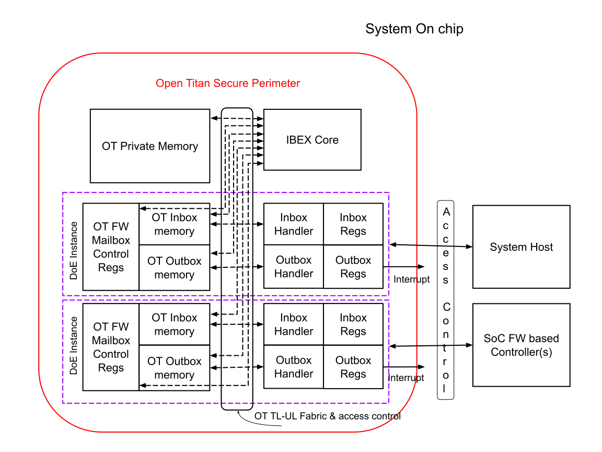
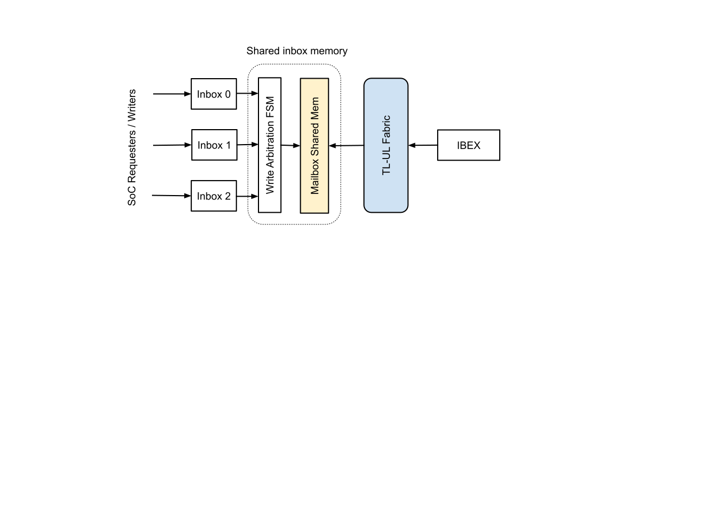
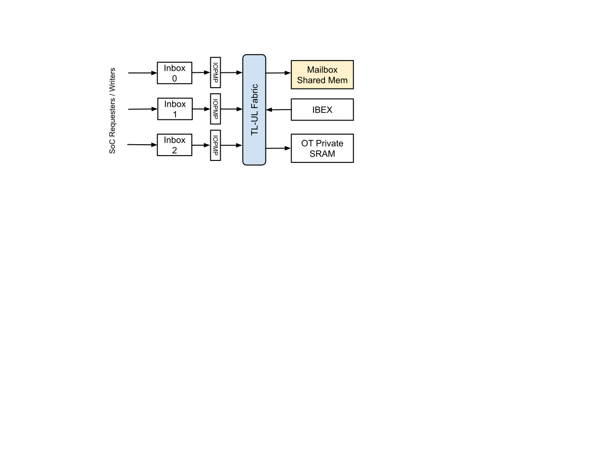
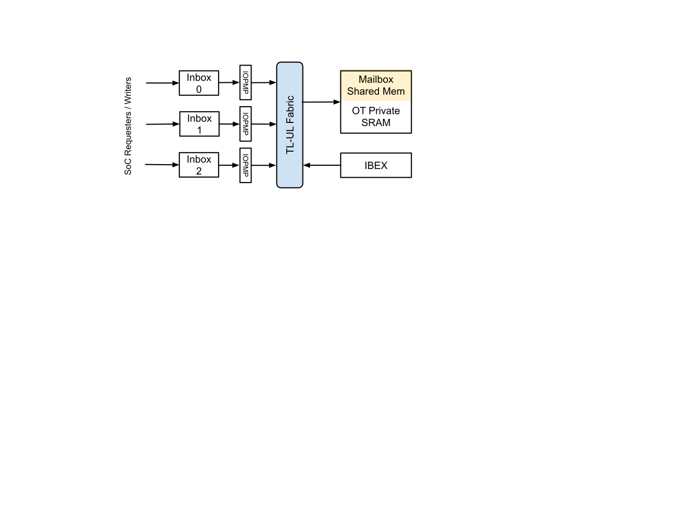

# OpenTitan Secure Mailbox Interface
# (secure\_mailbox\_spec)

Contributor: [Neeraj Upasani](mailto:neeraj@opentitan.org)

Reviewer: [Andreas Kurth](mailto:adk@opentitan.org) [Michael Schaffner](mailto:msf@opentitan.org)

Last Update: 2022-10-04

Approved by TC: 2023-05-09

Status: Draft v0.2

Table of Contents
=====================================================

Introduction
================================================

Scope
------------------------------

Document a proposal for the secure mailbox communication channel for the
Integrated OpenTitan project

Document Organization
----------------------------------------------

Glossary
---------------------------------

<table>
<colgroup>
<col style="width: 50%" />
<col style="width: 50%" />
</colgroup>
<tbody>
<tr class="odd">
<td>
Term
</td>
<td>
Description
</td>
</tr>
<tr class="even">
<td>
PCIe
</td>
<td>
PCI Express
</td>
</tr>
<tr class="odd">
<td>
DOE
</td>
<td>
Data Object Exchange
</td>
</tr>
<tr class="even">
<td>
CXL
</td>
<td>
Compute Express Link
</td>
</tr>
<tr class="odd">
<td>
MCTP
</td>
<td>
Management Component Transport Protocol
</td>
</tr>
<tr class="even">
<td>
SPDM
</td>
<td>
Security Protocol and Data Model
</td>
</tr>
<tr class="odd">
<td>
CMA
</td>
<td>
Component Measurement and Attestation
</td>
</tr>
<tr class="even">
<td>
 <a href="https://www.dmtf.org/about" class="c63">DMTF</a> 
</td>
<td>
formerly known as the Distributed Management Task Force
</td>
</tr>
<tr class="odd">
<td>
OT
</td>
<td>
OpenTitan
</td>
</tr>
<tr class="even">
<td>
RoT
</td>
<td>
Root Of Trust
</td>
</tr>
<tr class="odd">
<td>
CTN
</td>
<td>
ConTrol Network
</td>
</tr>
<tr class="even">
<td>
SoC
</td>
<td>
System On Chip
</td>
</tr>
<tr class="odd">
<td>
SCS
</td>
<td>
System Control Subsystem
</td>
</tr>
<tr class="even">
<td>
IOMMU
</td>
<td>
Input Output Memory Management Unit
</td>
</tr>
<tr class="odd">
<td>

ECR
</td>
<td>
Engineering Change Request
</td>
</tr>
<tr class="even">
<td>
ECN
</td>
<td>
Engineering Change Notification
</td>
</tr>
</tbody>
</table>

References
-----------------------------------

<table>
<colgroup>
<col style="width: 50%" />
<col style="width: 50%" />
</colgroup>
<tbody>
<tr class="odd">
<td>
OpenTitan Documentation 
</td>
<td>
 <a href="https://docs.opentitan.org/" class="c63">https://docs.opentitan.org/</a> 
</td>
</tr>
<tr class="even">
<td>

Integrated OpenTitan: Challenges To Solve
</td>
<td>
 <a href="https://docs.google.com/document/d/1bkt5QgAY8XPksH9D81sNyGWO9K1yjbOff0cUbZ9e9pw/edit" class="c63">Proposal Specification Link</a> 
</td>
</tr>
<tr class="odd">
<td>

Integrated OpenTitan: Access to SoC address space
</td>
<td>
 <a href="https://docs.google.com/document/d/1LsPEQo-XIgHL1N7BGRK1usMP8GGj5k3S3WyfyRbj3VQ/edit" class="c63">Proposal Specification Link</a> 
</td>
</tr>
<tr class="even">
<td>

Integrated OpenTitan: DMA Controller
</td>
<td>
 <a href="https://docs.google.com/document/d/1h0NJa-oBeFlTTswjkO-zk-r6Nb0sf_GN5Hou6581Aas/edit" class="c63">Proposal Specification Link</a> 
</td>
</tr>
<tr class="odd">
<td>

Integrated OpenTitan: DOE Mailbox Interface
</td>
<td>
 <a href="https://docs.google.com/document/d/10t11wB9nf9tHmFQgiq07KtK-pv2ISiigaYRLM9dU3K8/edit" class="c63">Proposal Specification Link</a> 
</td>
</tr>
<tr class="even">
<td>

Integrated OpenTitan: Design for Test and Debug
</td>
<td>
 <a href="https://docs.google.com/document/d/12gBsvx9TG32bdmTajbQ5jxLs1lY340ZGEs402mlZM_Q/edit" class="c63">Proposal Specification Link</a>   (Not Ready Yes)
</td>
</tr>
<tr class="odd">
<td>

PCIe Specification
</td>
<td>
 <a href="https://members.pcisig.com/wg/PCI-SIG/document/18363" class="c63">PCI Express</a> 
</td>
</tr>
<tr class="even">
<td>

CXL Specification
</td>
<td>
 <a href="https://www.computeexpresslink.org/download-the-specification" class="c63">Compute Express Link</a> 
</td>
</tr>
<tr class="odd">
<td>

SPDM
</td>
<td>
 <a href="https://www.dmtf.org/dsp/DSP0274" class="c63">https://www.dmtf.org/dsp/DSP0274</a> 

CMA requires SPDM Version 1.0 or above
</td>
</tr>
<tr class="even">
<td>

SPDM-MCTP
</td>
<td>
 <a href="https://www.dmtf.org/dsp/DSP0275" class="c63">https://www.dmtf.org/dsp/DSP0275</a> 
</td>
</tr>
<tr class="odd">
<td>

Secured SPDM
</td>
<td>
 <a href="https://www.dmtf.org/dsp/DSP0277" class="c63">https://www.dmtf.org/dsp/DSP0277</a> 
</td>
</tr>
</tbody>
</table>

Version History
----------------------------------------

<table>
<colgroup>
<col style="width: 33%" />
<col style="width: 33%" />
<col style="width: 33%" />
</colgroup>
<tbody>
<tr class="odd">
<td>
Version
</td>
<td>
Description
</td>
<td>
Authors
</td>
</tr>
<tr class="even">
<td>
0.1
</td>
<td>
Initial version
</td>
<td>
<a href="mailto:ved@rivosinc.com" class="c63">Ved Shanbhogue</a> <a href="mailto:shwen@rivosinc.com" class="c63">Ricky Wen</a> 

(Rivos Inc)
</td>
</tr>
<tr class="odd">
<td>
0.2
</td>
<td>
Added Context behind DOE

Object definition

Interrupt tweaks
</td>
<td>
 <a href="mailto:neeraj@rivosinc.com" class="c63">Neeraj Upasani</a> 

(Rivos Inc)
</td>
</tr>
</tbody>
</table>

Overview
========

The integrated version of OpenTitan Root-Of-Trust may
provide security services to the SoC such as:

-   Encryption or decryption of data blobs
-   Cryptographic hashing of data blobs
-   Key derivation
-   Random seed generation service
-   Public Key ( PK ) signing
-   PK verification
-   Root of Trust for Measurement , Reporting and
    Storage
-   Secure Firmware update
-   Access to secure storage
-   Mutual authentication / attestation services
-   SoC security monitoring / book-keeping
    services
-   Debug authentication / unlock service

The SoC Host (or other SoC Execution Engines) may request these services
from the OpenTitan. This means that pre-defined control information must
be passed to OpenTitan from the security service requester. A secure
in-bound/outbound mailbox is defined to exchange such control
information between. This proposal adopts the  [PCIe specification defined Data-Object-Exchange](https://members.pcisig.com/wg/PCI-SIG/document/18363)
mailbox protocol  as the OpenTitan Integrated
mailbox communication channel.

As an example, the DMA controller shall be used in conjunction with the
newly defined OpenTitan mailbox interface. Mailbox interface is used to
pass pointers to data blobs external  to the OT RoT and  request
operations via pre-defined command  objects .

Secure Mailbox Interface
=======================================================

  

### Data Object Exchange Mailbox Instance

Mailbox Terminology
--------------------------------------------

<table>
<colgroup>
<col style="width: 50%" />
<col style="width: 50%" />
</colgroup>
<tbody>
<tr class="odd">
<td>
OT Mailbox  registers  (Inbox regs / Outbox regs)
</td>
<td><ul>
<li>PCIe DOE specification defined registers used for reading and writing to the mailbox. See PCI Express Base Specification 6.0 section 7.9.24</li>
<li>Note that these registers may be mapped into the PCIe Config space for the System Host to access the mailbox via the PCIe defined mechanism</li>
<li>Accesses from other SoC firmware based agents may not be mapped into the config address space. The access mechanism and relevant address space for such agents is defined by the SoC integrator</li>
</ul></td>
</tr>
<tr class="even">
<td>
OT Inbox Memory
</td>
<td><ul>
<li>Memory is allocated to the mailbox mechanism to store data objects passed from System/SoC mailbox  writer  to OT.</li>
<li>Memory within the OpenTitan RoT secure perimeter. Please refer to the section below for   <a href="#IntegratedOpenTitanDOEMailboxInterface.xhtml#h.n5og8dnip5q5" class="c63">inbox memory implementation options</a> </li>
<li>System/SoC mailbox  writer  can write this memory via mailbox interface registers only </li>
<li>OT Ibex core may have direct read/write access to this memory</li>
</ul></td>
</tr>
<tr class="odd">
<td>
OT Outbox Memory
</td>
<td><ul>
<li>Memory is allocated to the mailbox mechanism to store data objects passed from OT to System/SoC mailbox  reader .</li>
<li>This memory is within the OpenTitan RoT secure perimeter; It may be a dedicated memory structure or carved out section (protected by access control) of a larger memory</li>
<li>System/SoC mailbox  reader  can read this memory via mailbox interface registers only </li>
<li>OT Ibex core may have direct read/write access to this memory</li>
</ul></td>
</tr>
<tr class="even">
<td>
DOE mailbox instance
</td>
<td><ul>
<li>A collection of the mailbox registers, inbound mailbox memory and outbound mailbox memory that can be used to exchange objects between OT and an SoC agent</li>
<li>Note that a separate  mailbox instance  is  required  for each uncoordinated SoC agent that communicates with Integrated OT via mailbox mechanism  </li>
<li>OT may handle (read or write) objects from each DOE instance in a simple round robin arbitration fashion.  Note  that this is firmware controlled based on pending mailbox interrupts </li>
</ul></td>
</tr>
<tr class="odd">
<td>
Inbox / Outbox Handler
</td>
<td><ul>
<li>Hardware widget to move mailbox data back and forth between mailbox registers and corresponding memories</li>
</ul></td>
</tr>
<tr class="even">
<td>
Requester
</td>
<td><ul>
<li>Typically System Host or an SoC firmware agent that would request a security service via predefined DOE objects</li>
</ul></td>
</tr>
<tr class="odd">
<td>
Responder
</td>
<td><ul>
<li>Entity that processes the DOE request object and generates a DOE response in case one is expected for the original request.</li>
<li>OpenTitan would generally have the responder role; however there may be use cases where OpenTitan is a DOE requester</li>
</ul></td>
</tr>
</tbody>
</table>

### Mailbox memory Options

Mailbox memory implementation shall have the following options

<table>
<colgroup>
<col style="width: 33%" />
<col style="width: 33%" />
<col style="width: 33%" />
</colgroup>
<tbody>
<tr class="odd">
<td>
Option
</td>
<td>
Pros
</td>
<td>
Cons
</td>
</tr>
<tr class="even">
<td>
Dedicated Memory within mailbox instance

  
</td>
<td><ul>
<li>Each mailbox instance has access to its own inbox memory space </li>
<li>No memory arbitration required when mailbox is written writing</li>
<li>Easy to prevent IBEX instruction fetch port from accessing mailbox memory (prevent address decode)</li>
</ul>

</td>
<td><ul>
<li>Difficult to implement memory protection mechanisms such as scrambling</li>
</ul></td>
</tr>
<tr class="odd">
<td>
Shared Mailbox Memory - local write port, read access by memory

(separate instance than RoT private memory)

    

</td>
<td><ul>
<li>Easier to implement memory protection schemes such as scrambling, if desired</li>
<li>Mailboxes not an initiator on TL-UL fabric; additional access control not required</li>
<li>Easy to prevent IBEX instruction fetch port from accessing mailbox memory (prevent address decode)</li>
</ul>

</td>
<td><ul>
<li>Memory controller may need dedicated arbitration logic</li>
</ul></td>
</tr>
<tr class="even">
<td>
Shared Mailbox Memory On RoT Fabric

(separate instance than RoT private memory)

  

</td>
<td><ul>
<li>Memory access arbitration handled by fabric</li>
<li>Easier to implement memory protection schemes such as scrambling, if desired</li>
<li>Easy to prevent IBEX instruction fetch port from accessing mailbox memory (prevent address decode)</li>
</ul>

</td>
<td><ul>
<li>Mailbox port is an initiator port on the fabric; requires additional security access control mechanisms such as IOPMP (access range protection registers etc)</li>
</ul></td>
</tr>
<tr class="odd">
<td>
Shared Mailbox Memory carved out of RoT private memory)

Note  that this option is not preferred

  
</td>
<td><ul>
<li>Easier to manage memory size requirements - (flexible range setup)</li>
</ul>

</td>
<td><ul>
<li>Hard address decode based prevention of IBEX instruction fetch from this memory not possible - mixed with IBEX code memory</li>
</ul>

</td>
</tr>
</tbody>
</table>

Mailbox Basics
----------------------------------------

-   PCIe specification section 6.30 defines the
    (optional) Data Object Exchange mechanism. It is accessed using a
    PCIe extended capability defined in section 7.9.24 that provides a
    Mailbox for data exchange.
-   All inbound and outbound mailbox communication
    takes place via a set of mailbox registers

    -    [DOE Control Register](#doe-control-register)
    -    [DOE Status Register](#doe-status-register)
    -    [DOE Write Data Mailbox Register](#doe-write-data-mailbox-register)
    -    [DOE Read Data Mailbox Register](#doe-read-data-mailbox-register)

-   [DOE Control Register](#doe-control-register)
    and  [DOE Status Register](#doe-status-register)
    are used by the requester and the responder to perform a
    valid handshake protocol while transferring objects back and forth
-   An entity that supports the DOE mechanism is
    permitted to specify its own vendor defined data objects
-   DOE Inbox is used by a ‘requester’ to query the supported data
    object formats

    -   A mailbox instance is not required to support all
        DOE object formats.
    -   PCIe Vendor ID and an object format index number
        together uniquely identify the supported object format
    -   Mailbox requester FW/SW knows how to interpret the
        data object format(s) of interest
    -   DOE specification defined query mechanism enables
        Mailbox requester to check if the DOE instance supports the data
        object format of interest

-   DOE Inbox is used by a ‘requester’ to write
    supported data objects into the DOE mailbox

    -   DOE mailbox drops the object in case it is an
        unsupported format or does not match the expected format
    -   Each mailbox write is a non-posted transaction and
        expects a response back
    -   [DOE Write Data Mailbox Register](#doe-write-data-mailbox-register)
        is used to write the inbox, one DWORD (32 bit) at a time

-   DOE Outbox is used by the responder to populate a
    response, in case one is expected
-   DOE instances have the ability to send an interrupt
    to notify that an object response is ready. Note that a PCIe
    compatible DOE mailbox instance shall have the ability to send an
    MSI interrupt
-   Various error handling scenarios are described
    later in this document

Following is a basic mailbox read / write sequence:

1.  [DOE Status Register](#doe-status-register).
    Busy being Clear indicates
    that the mailbox instance is not being actively used and is ready to
    accept new requests. System Host consults this bit to check if the
    DOE instance is free.
2.  System host writes the entire data object a DWORD at a time via the
    [DOE Write Data Mailbox Register](#doe-write-data-mailbox-register)

    1.  The inbox handler places each DWORD into the appropriate location of
        the OT inbox memory to assemble the object being transferred

1.  System host sets the DOE Go bit in  [DOE Control Register](#doe-control-register)

    1.  The inbox handler generates an interrupt to notify
        the responder (e.g. OpenTitan Ibex core) to start parsing the
        transferred object
    2.  The parser consumes the DOE request from the DOE
        mailbox.

1.  After successful processing, the responder (OT Ibex
    core) generates a response, in case one is expected

    1.  OT host places the response in the outbox
        memory
    2.  OT host sets the Data Object Ready bit
    3.  DOE outbox handler generates a notification
        interrupt, if supported and enabled

1.  System host waits for an interrupt  if applicable. Upon receiving an
    interrupt, it checks the [DOE Status Register](#doe-status-register).*ready*
    bit to see if the object is ready.
    Alternatively, if an interrupt is not supported, it can poll for the
    polls the  [DOE Status Register](#doe-status-register).*ready* bit
    Note that SoC level power
    management schemes and related interrupt delivery mechanism is outside
    the scope of this document. Any logic required to support SoC wake from
    deeper power management states for interrupt delivery shall be
    implemented at the SoC level at the time of integration

1.  If the ready bit is Set,

    1.  System host reads data from the  [DOE Read Data Mailbox Register](#doe-read-data-mailbox-register)
        one DWORD at a time
    2.  For each DWORD, it  writes the  [DOE Read Data Mailbox Register](#doe-read-data-mailbox-register)
        to indicate a successful read
    3.  The process is repeated until the entire object is
        read

Note :

Sequence above assumes System Host as the requester of
the mailbox object write. In this case a PCIe compliant DOE mailbox
instance is implemented. Similar mechanism and sequence would apply for
communication with other SoC firmware controllers. For such a DOE
mailbox instance, a fully PCIe compliant implementation is not required.
See [below](#system-level-use-cases)
for more details

Note : Please refer to [PCIE Specification](https://members.pcisig.com/wg/PCI-SIG/document/18363)
for more detailed and up to date information
on the PCIe compliant DOE Mailbox operation basics

Integrated OpenTitan Usage Of DOE Mailbox Mechanism
----------------------------------------------------------------------------

Integrated OpenTitan

-   Shall adopt the basic mechanics defined in the PCIe
    specification
-   Shall support one or more DOE mailbox instances

-   Shall support design options to allow configuration
    of number of mailbox instances depending upon the needs of the
    integrating SoC

-   Interrupt support

    -   Shall support a firmware based mechanism to
        generate an interrupt
    -   Such a mechanism may require a method to ‘write’ to a predefined  address in the
        appropriate address space (System, CTN or other) via the
        corresponding port of a DMA controller
    -   Example: Write to a location within system address space via the
        [SYS port of the Integrated OT DMA controller](../dma/README.md)
        to generate an MSI-interrupt for PCIe
        compatible DOE instance(s)
    -   Shall support a wired interrupt output(s) for each DOE instance.
        Such a mechanism may be applied for DOE instances assigned to agents
        that support wired interrupt  mechanism
    -   Depending upon the application & PCIe compatibility requirement for
        the instance, SoC may decide to use the wired interrupt or firmware
        based MSI interrupt mechanism at the time of SoC integration. Alternatively, for PCIe compatible DOE mailbox instance,
        an SoC may also decide to convert the wired interrupt into an MSI
        via dedicated hardware support at the SoC level

-   Not required to support a dedicated mutex mechanism for more than
    one agent to access the same DOE instance
-   Object Definition; Vendor ID

Integrating SoC

-   For the DOE instance dedicated to System
    Host

    -   Shall provide the plumbing to map into PCIe Config
        address space
    -   Shall provide the plumbing necessary to route the MSI interrupt to
        the appropriate location in the SoC’s  [system address space]()

-   For mailboxes dedicated to other SoC FW
    agents

    -   Shall provide an access controlled path for the SoC
        FW Agent to access the DOE registers
    -   Shall provide the plumbing necessary to route the MSI interrupt to
        the appropriate location in the SoC’s  [relevant address space (System,]()
        [CTN]() [ or other))]()

-   Access control

    -   Shall provide proper access control protection to
        make sure that no requester other than the one to which the mailbox
        is assigned, is able to access the mailbox registers
    -   Access control may be static or dynamic based on
        SoC level access mechanisms

-   Assigning more than one coordinated requesters /
    agents to the same DOE instance

    -   If the SoC chooses to do so then it will be the responsibility of
        the cooperating agents to get ownership of the DOE mailbox in a SoC
        defined synchronization mechanism
    -   Consider an example where there are more than one
        physical instance of SoC firmware based controllers implementing a
        common function like power management. In such a case, the two power
        management controllers may acquire a software mutex or a hardware
        mutex, as defined and implemented by SoC

Mailbox Use Cases
-----------------

### Interprocessor Communication

A basic usage of the DOE mailbox mechanism is to
achieve Interprocessor communication (IPC) between the OpenTitan based
SoC root of trust and other SoC firmware based controllers. An example
scenario is as follows:

Such an IPC mechanism may be deployed during a system secure boot up
operation. Here OT RoT  has the responsibility to fetch firmware images
from external flash, verify / measure  them and place in appropriate
memory locations on the SoC that are protected via access control
mechanisms to prevent further modification of firmware images. Other
firmware based controllers may be configured to boot from such a memory
location. Proper reset sequencing, voltage, clock and other
configuration of the SoC region / subsystem under consideration may be
needed prior to this operation. An SoC power management controller (PMC)
may be responsible for these activities. OT RoT and the PMC may need to
work together to complete the operation to bootstrap the firmware based
controller of a subsystem under consideration. OT RoT
and the PMC may exchange messages via DOE based mailbox mechanism
through predefined message data objects to achieve this coordination.
 More coordination may be required during
runtime as well and may continue to use the mailboxes for further
communication beyond boot time operation

In another example, more than one OT RoT  instance may
exist within an SoC - for example an RoT on each chiplet in an SoC
compiled of multiple chiplets. Such RoTs may have a primary - secondary
relationship, and may require communication to perform different
operations. A dedicated DOE mailbox channel and predefined DOE objects
may be assigned for such communication

### System level use cases

DOE mailbox is used to perform various security
protocols like SPDM based component measurement and authentication.

As per the PCIe specification - “DOE is a prerequisite
Extended Capability for a Function to support in-band access by system
firmware/software using Configuration Requests to Component Measurement
and Authentication (CMA). CMA in turn builds on \[SPDM\].”

#### PCIE component measurement

A  PCIe device, either discrete or integrated within a
system, may need to establish a security trust level with the
appropriate software running on the System Host for various security
based applications like:

-   Allowing a datacenter operator to query the state
    of the platform via remote mechanisms before deploying any workloads
    to the platform. Such mechanisms may involve cryptographic
    measurements of the hardware components including any unique device
    bindings and firmware running on that platform, and attestation to a
    local (e.g sideband management controller) or a remote (e.g.
    datacenter operator) agent. An OpenTitan base root of trust
    integrated within a PCIe device may participate in such an
    authentication protocol, with the responsibility to create such
    measurements and present them to the system software upon request
    via a standard PCIe based DOE mailbox communication channel.
-   Similar authentication scheme may be used for PCIe
    device hot plug support (adding new cards during system runtime)
    where the system software may decide to include the hot plugged
    device within its operation only upon successfully attesting to a
    local agent or a remote agent

#### Setup of Trusted Execution Environments

An SoC may participate in providing Trusted Execution
environments. An integrated root of trust would have the responsibility
to bring up, perform secure boot, measure, establish the proper chain of
trust in order to bootstrap the trusted execution environment. Trusted
Software would use the DOE mailbox communication channel to establish
secure protocols with the additional components (e.g. a new PCIe virtual
function) before allowing them into the trusted execution
boundary.

#### Generic security services

An integrated OpenTitan RoT may provide generic
security services to the SoC or system as a whole, such as secure
storage, secure firmware update, PK crypto based certificate signing,
encryption/decryption. Such operations require exchange of information
(commands as well as data) back and forth between the  requesters of
these security services and OT. DOE mailbox mechanism with properly
defined DOE objects supporting such information exchange is envisioned
to be the method to expose these security services to other
components

Security Properties
----------------------------------------------------------------------------------

&lt;To be Worked on&gt;

Data Object Definition
-----------------------------------------------

### PCIe defined

Following are the PCIe specification defined object types that shall be
supported by the OT DOE implementation

<table>
<colgroup>
<col style="width: 33%" />
<col style="width: 33%" />
<col style="width: 33%" />
</colgroup>
<tbody>
<tr class="odd">
<td>
Vendor ID

(PCIe SIG)
</td>
<td>
Data Object Type
</td>
<td>
Description
</td>
</tr>
<tr class="even">
<td>
0x0001
</td>
<td>
0x00
</td>
<td>
DOE Discovery

Used by the requester to find the supported data objects by the DOE instance. PCIe specification defines the mechanism for object discovery
</td>
</tr>
<tr class="odd">
<td>
0x0001
</td>
<td>
0x01
</td>
<td>
CMA/SPDM

Data Object type for SPDM

Section 6.31 of PCIe specification shows the PCIe bindings

DMTF DSP0274 specifies the SPDM messages

</td>
</tr>
<tr class="even">
<td>
0x0001
</td>
<td>
0x02
</td>
<td>
Secured SPDM

Data Object type for SPDM secure sessions

Also requires support for CMA/SPDM (Type 0x01)

Section 6.31.4 of PCIe spec shows the PCIe bindings

DMTF DSP0277 specifies the secured SPDM messages
</td>
</tr>
<tr class="odd">
<td>
0x0001
</td>
<td>
0x03
</td>
<td>
CMA/SPDM with Connection ID

Also requires support for CMA/SPDM (Type 0x01)
</td>
</tr>
<tr class="even">
<td>
0x0001
</td>
<td>
0x04
</td>
<td>
Secured CMA/SPDM with Connection ID

Also requires support for secured CMA/SPDM (Type 0x02)
</td>
</tr>
<tr class="odd">
<td>
0x0001
</td>
<td>
0x05
</td>
<td>
Async Message

Asynchronous messages generated by the device to communicate asynchronous with the Host SW
</td>
</tr>
<tr class="even">
<td>
0x0001
</td>
<td>
0x06-FF
</td>
<td>
Reserved
</td>
</tr>
</tbody>
</table>

Notes :

1.  Support for the above object types are required for
    the PCIe compatible mailbox(es)
2.  Implementation, processing and handling of the objects & protocols
    behind th em are handled by OT firmware and Host
    software
3.  Non-PCIe DOE mailboxes may choose to support these
    object types if there is a supporting use case
4.  The objects highlighted in red are part of a PCIe
    ECR that is not in the main specification yet

------------------------------------------------------------------------

### OT defined DOE objects

Please refer to  [Integrated OT DMAC](../dma/README.md)
  specification and  [OT Access to SoC address space]()
  documents for additional details on the DMA
controller and relevant address spaces

#### Simple DMA transfer request

Requester specifies Source address, Destination
address, source space ID and Destination space ID as required by the DMA
transfer operation. Integrated OpenTitan Host firmware parses the
object, checks the request and configures the OT DMA controller if it
deems the transfer to be OK.

Response Object:  [Response DOE object expected](#simple-dma-completion-response-object)

Interrupt: Can be configured to generate interrupt to
Requester, if enabled, once DMA transfer complete

<table markdown="1" class="c80">
<tr markdown="1" class="c5">
<td markdown="1" class="c11" colspan="1" rowspan="1">31</td>
<td markdown="1" class="c7" colspan="1" rowspan="1">30</td>
<td markdown="1" class="c7" colspan="1" rowspan="1">29</td>
<td markdown="1" class="c7" colspan="1" rowspan="1">28</td>
<td markdown="1" class="c7" colspan="1" rowspan="1">27</td>
<td markdown="1" class="c7" colspan="1" rowspan="1">26</td>
<td markdown="1" class="c7" colspan="1" rowspan="1">25</td>
<td markdown="1" class="c122" colspan="1" rowspan="1">24</td>
<td markdown="1" class="c78" colspan="1" rowspan="1">23</td>
<td markdown="1" class="c26" colspan="1" rowspan="1">22</td>
<td markdown="1" class="c26" colspan="1" rowspan="1">21</td>
<td markdown="1" class="c26" colspan="1" rowspan="1">20</td>
<td markdown="1" class="c26" colspan="1" rowspan="1">19</td>
<td markdown="1" class="c26" colspan="1" rowspan="1">18</td>
<td markdown="1" class="c26" colspan="1" rowspan="1">17</td>
<td markdown="1" class="c77" colspan="1" rowspan="1">16</td>
<td markdown="1" class="c42" colspan="1" rowspan="1">15</td>
<td markdown="1" class="c26" colspan="1" rowspan="1">14</td>
<td markdown="1" class="c26" colspan="1" rowspan="1">13</td>
<td markdown="1" class="c26" colspan="1" rowspan="1">12</td>
<td markdown="1" class="c26" colspan="1" rowspan="1">11</td>
<td markdown="1" class="c26" colspan="1" rowspan="1">10</td>
<td markdown="1" class="c26" colspan="1" rowspan="1">09</td>
<td markdown="1" class="c77" colspan="1" rowspan="1">08</td>
<td markdown="1" class="c42" colspan="1" rowspan="1">07</td>
<td markdown="1" class="c26" colspan="1" rowspan="1">06</td>
<td markdown="1" class="c26" colspan="1" rowspan="1">05</td>
<td markdown="1" class="c26" colspan="1" rowspan="1">04</td>
<td markdown="1" class="c26" colspan="1" rowspan="1">03</td>
<td markdown="1" class="c26" colspan="1" rowspan="1">02</td>
<td markdown="1" class="c26" colspan="1" rowspan="1">01</td>
<td markdown="1" class="c35" colspan="1" rowspan="1">00</td>
<td markdown="1" class="c60" colspan="1" rowspan="1">Byte Offset</td>
</tr>
<tr markdown="1" class="c21">
<td markdown="1" class="c24" colspan="8" rowspan="1">Reserved</td>
<td markdown="1" class="c24" colspan="8" rowspan="1">Object Data Type=0x0</td>
<td markdown="1" class="c84" colspan="16" rowspan="1">Vendor ID=&lt;OT TBD&gt;</td>
<td markdown="1" class="c22" colspan="1" rowspan="1">0x0</td>
</tr>
<tr markdown="1" class="c21">
<td markdown="1" class="c85" colspan="14" rowspan="1">Reserved</td>
<td markdown="1" class="c55" colspan="18" rowspan="1">Length =  0x8 DWORDS</td>
<td markdown="1" class="c22" colspan="1" rowspan="1">0x4</td>
</tr>
<tr markdown="1" class="c21">
<td markdown="1" class="c24" colspan="8" rowspan="1">Reserved</td>
<td markdown="1" class="c24" colspan="8" rowspan="1">Opcode = &lt;SimpleDMA&gt;</td>
<td markdown="1" class="c24" colspan="8" rowspan="1">

Reserved\[15:10\],

Dest Addr Space ID\[9:8\]

</td>
<td markdown="1" class="c24" colspan="8" rowspan="1">

Reserved\[7:2\],

Source Addr Space ID\[1:0\]

</td>
<td markdown="1" class="c22" colspan="1" rowspan="1">0x8</td>
</tr>
<tr markdown="1" class="c21">
<td markdown="1" class="c49" colspan="32" rowspan="1">Total Data size  (in bytes)</td>
<td markdown="1" class="c22" colspan="1" rowspan="1">0xC</td>
</tr>
<tr markdown="1" class="c21">
<td markdown="1" class="c49" colspan="32" rowspan="1">Source Address Low</td>
<td markdown="1" class="c22" colspan="1" rowspan="1">0x10</td>
</tr>
<tr markdown="1" class="c21">
<td markdown="1" class="c49" colspan="32" rowspan="1">

Source Address High (Used only if targeting 64 bit
address space; else all zero)

</td>
<td markdown="1" class="c22" colspan="1" rowspan="1">0x14</td>
</tr>
<tr markdown="1" class="c21">
<td markdown="1" class="c49" colspan="32" rowspan="1">Destination Address Low</td>
<td markdown="1" class="c38" colspan="1" rowspan="1">0x18</td>
</tr>
<tr markdown="1" class="c21">
<td markdown="1" class="c49" colspan="32" rowspan="1">

Destination Address High (Used only if targeting 64
bit address space; else all zero)

</td>
<td markdown="1" class="c109" colspan="1" rowspan="1">0x1C</td>
</tr>
</table>

#### Simple DMA completion response object

DMA transfer completion response to the requester.
Response object conveys the status of the operation.

<table markdown="1" class="c80">
<tr markdown="1" class="c5">
<td markdown="1" class="c11" colspan="1" rowspan="1">31</td>
<td markdown="1" class="c7" colspan="1" rowspan="1">30</td>
<td markdown="1" class="c7" colspan="1" rowspan="1">29</td>
<td markdown="1" class="c7" colspan="1" rowspan="1">28</td>
<td markdown="1" class="c7" colspan="1" rowspan="1">27</td>
<td markdown="1" class="c7" colspan="1" rowspan="1">26</td>
<td markdown="1" class="c7" colspan="1" rowspan="1">25</td>
<td markdown="1" class="c122" colspan="1" rowspan="1">24</td>
<td markdown="1" class="c78" colspan="1" rowspan="1">23</td>
<td markdown="1" class="c26" colspan="1" rowspan="1">22</td>
<td markdown="1" class="c26" colspan="1" rowspan="1">21</td>
<td markdown="1" class="c26" colspan="1" rowspan="1">20</td>
<td markdown="1" class="c26" colspan="1" rowspan="1">19</td>
<td markdown="1" class="c26" colspan="1" rowspan="1">18</td>
<td markdown="1" class="c26" colspan="1" rowspan="1">17</td>
<td markdown="1" class="c77" colspan="1" rowspan="1">16</td>
<td markdown="1" class="c42" colspan="1" rowspan="1">15</td>
<td markdown="1" class="c26" colspan="1" rowspan="1">14</td>
<td markdown="1" class="c26" colspan="1" rowspan="1">13</td>
<td markdown="1" class="c26" colspan="1" rowspan="1">12</td>
<td markdown="1" class="c26" colspan="1" rowspan="1">11</td>
<td markdown="1" class="c26" colspan="1" rowspan="1">10</td>
<td markdown="1" class="c26" colspan="1" rowspan="1">09</td>
<td markdown="1" class="c77" colspan="1" rowspan="1">08</td>
<td markdown="1" class="c42" colspan="1" rowspan="1">07</td>
<td markdown="1" class="c26" colspan="1" rowspan="1">06</td>
<td markdown="1" class="c26" colspan="1" rowspan="1">05</td>
<td markdown="1" class="c26" colspan="1" rowspan="1">04</td>
<td markdown="1" class="c26" colspan="1" rowspan="1">03</td>
<td markdown="1" class="c26" colspan="1" rowspan="1">02</td>
<td markdown="1" class="c26" colspan="1" rowspan="1">01</td>
<td markdown="1" class="c35" colspan="1" rowspan="1">00</td>
<td markdown="1" class="c60" colspan="1" rowspan="1">Byte Offset</td>
</tr>
<tr markdown="1" class="c21">
<td markdown="1" class="c24" colspan="8" rowspan="1">Reserved</td>
<td markdown="1" class="c24" colspan="8" rowspan="1">Object Data Type= 0x0</td>
<td markdown="1" class="c84" colspan="16" rowspan="1">Vendor ID=&lt;OT TBD&gt;</td>
<td markdown="1" class="c22" colspan="1" rowspan="1">0x0</td>
</tr>
<tr markdown="1" class="c21">
<td markdown="1" class="c85" colspan="14" rowspan="1">Reserved</td>
<td markdown="1" class="c55" colspan="18" rowspan="1">Length =  0x3 DWORDS</td>
<td markdown="1" class="c22" colspan="1" rowspan="1">0x4</td>
</tr>
<tr markdown="1" class="c21">
<td markdown="1" class="c49" colspan="32" rowspan="1">

DMA Completion Status {Error Code, Error/Success,
Done}; \[exact format TBD\]

</td>
<td markdown="1" class="c22" colspan="1" rowspan="1">0x8</td>
</tr>
</table>

#### Firmware Update request

Used by System Host software to initiate a firmware
update request. System software places the firmware update blob in the
system memory. Requester specifies Source address pointer to memory. The
source address space ID is fixed toSystem). Destination address shall be
ignored by the responder. Destination address space ID is fixed to 0x03
(FLASH). Note that the assumption here is that OT RoT firmware is in
control and aware of the Flash map.

Integrated OpenTitan Host firmware parses the object, checks the request
and configures the OT DMA controller if it deems the transfer to be OK
to write the update binary into an appropriate location of the OT flash,
cryptographically verifies the update candidate blob , then initiates
and completes the final flash update operation upon successful
verification.

Response Object:  [Response DOE object expected](#simple-dma-completion-response-object)

<table markdown="1" class="c80">
<tr markdown="1" class="c5">
<td markdown="1" class="c11" colspan="1" rowspan="1">31</td>
<td markdown="1" class="c7" colspan="1" rowspan="1">30</td>
<td markdown="1" class="c7" colspan="1" rowspan="1">29</td>
<td markdown="1" class="c7" colspan="1" rowspan="1">28</td>
<td markdown="1" class="c7" colspan="1" rowspan="1">27</td>
<td markdown="1" class="c7" colspan="1" rowspan="1">26</td>
<td markdown="1" class="c7" colspan="1" rowspan="1">25</td>
<td markdown="1" class="c122" colspan="1" rowspan="1">24</td>
<td markdown="1" class="c78" colspan="1" rowspan="1">23</td>
<td markdown="1" class="c26" colspan="1" rowspan="1">22</td>
<td markdown="1" class="c26" colspan="1" rowspan="1">21</td>
<td markdown="1" class="c26" colspan="1" rowspan="1">20</td>
<td markdown="1" class="c26" colspan="1" rowspan="1">19</td>
<td markdown="1" class="c26" colspan="1" rowspan="1">18</td>
<td markdown="1" class="c26" colspan="1" rowspan="1">17</td>
<td markdown="1" class="c77" colspan="1" rowspan="1">16</td>
<td markdown="1" class="c42" colspan="1" rowspan="1">15</td>
<td markdown="1" class="c26" colspan="1" rowspan="1">14</td>
<td markdown="1" class="c26" colspan="1" rowspan="1">13</td>
<td markdown="1" class="c26" colspan="1" rowspan="1">12</td>
<td markdown="1" class="c26" colspan="1" rowspan="1">11</td>
<td markdown="1" class="c26" colspan="1" rowspan="1">10</td>
<td markdown="1" class="c26" colspan="1" rowspan="1">09</td>
<td markdown="1" class="c77" colspan="1" rowspan="1">08</td>
<td markdown="1" class="c42" colspan="1" rowspan="1">07</td>
<td markdown="1" class="c26" colspan="1" rowspan="1">06</td>
<td markdown="1" class="c26" colspan="1" rowspan="1">05</td>
<td markdown="1" class="c26" colspan="1" rowspan="1">04</td>
<td markdown="1" class="c26" colspan="1" rowspan="1">03</td>
<td markdown="1" class="c26" colspan="1" rowspan="1">02</td>
<td markdown="1" class="c26" colspan="1" rowspan="1">01</td>
<td markdown="1" class="c35" colspan="1" rowspan="1">00</td>
<td markdown="1" class="c60" colspan="1" rowspan="1">Byte Offset</td>
</tr>
<tr markdown="1" class="c21">
<td markdown="1" class="c24" colspan="8" rowspan="1">Reserved</td>
<td markdown="1" class="c24" colspan="8" rowspan="1">Object Data Type= 0x1</td>
<td markdown="1" class="c84" colspan="16" rowspan="1">Vendor ID=&lt;OT TBD&gt;</td>
<td markdown="1" class="c22" colspan="1" rowspan="1">0x0</td>
</tr>
<tr markdown="1" class="c21">
<td markdown="1" class="c85" colspan="14" rowspan="1">Reserved</td>
<td markdown="1" class="c55" colspan="18" rowspan="1">Length = 0x8 DWORDS</td>
<td markdown="1" class="c22" colspan="1" rowspan="1">0x4</td>
</tr>
<tr markdown="1" class="c21">
<td markdown="1" class="c24" colspan="8" rowspan="1">

Interrupt to Requester  = &lt;Yes/No&gt;

</td>
<td markdown="1" class="c24" colspan="8" rowspan="1">

Opcode = &lt;FirmwareUpdate&gt;

</td>
<td markdown="1" class="c24" colspan="8" rowspan="1">Reserved\[15:08\],</td>
<td markdown="1" class="c24" colspan="8" rowspan="1">Reserved\[7:0\],</td>
<td markdown="1" class="c22" colspan="1" rowspan="1">0x8</td>
</tr>
<tr markdown="1" class="c21">
<td markdown="1" class="c49" colspan="32" rowspan="1">Total Data size (in bytes)</td>
<td markdown="1" class="c22" colspan="1" rowspan="1">0xC</td>
</tr>
<tr markdown="1" class="c21">
<td markdown="1" class="c49" colspan="32" rowspan="1">Source Address Low</td>
<td markdown="1" class="c22" colspan="1" rowspan="1">0x10</td>
</tr>
<tr markdown="1" class="c21">
<td markdown="1" class="c49" colspan="32" rowspan="1">

Source Address High (Used only if targeting 64 bit
address space; else all zero)

</td>
<td markdown="1" class="c22" colspan="1" rowspan="1">0x14</td>
</tr>
<tr markdown="1" class="c21">
<td markdown="1" class="c49" colspan="32" rowspan="1">Reserved</td>
<td markdown="1" class="c38" colspan="1" rowspan="1">0x18</td>
</tr>
<tr markdown="1" class="c21">
<td markdown="1" class="c49" colspan="32" rowspan="1">Reserved</td>
<td markdown="1" class="c109" colspan="1" rowspan="1">0x1C</td>
</tr>
</table>

#### Firmware Update  Ready for Reset Notification

Notify Requester, to system HOST that it is ready for system reset to
complete the update operation .

<table markdown="1" class="c80">
<tr markdown="1" class="c5">
<td markdown="1" class="c11" colspan="1" rowspan="1">31</td>
<td markdown="1" class="c7" colspan="1" rowspan="1">30</td>
<td markdown="1" class="c7" colspan="1" rowspan="1">29</td>
<td markdown="1" class="c7" colspan="1" rowspan="1">28</td>
<td markdown="1" class="c7" colspan="1" rowspan="1">27</td>
<td markdown="1" class="c7" colspan="1" rowspan="1">26</td>
<td markdown="1" class="c7" colspan="1" rowspan="1">25</td>
<td markdown="1" class="c122" colspan="1" rowspan="1">24</td>
<td markdown="1" class="c78" colspan="1" rowspan="1">23</td>
<td markdown="1" class="c26" colspan="1" rowspan="1">22</td>
<td markdown="1" class="c26" colspan="1" rowspan="1">21</td>
<td markdown="1" class="c26" colspan="1" rowspan="1">20</td>
<td markdown="1" class="c26" colspan="1" rowspan="1">19</td>
<td markdown="1" class="c26" colspan="1" rowspan="1">18</td>
<td markdown="1" class="c26" colspan="1" rowspan="1">17</td>
<td markdown="1" class="c77" colspan="1" rowspan="1">16</td>
<td markdown="1" class="c42" colspan="1" rowspan="1">15</td>
<td markdown="1" class="c26" colspan="1" rowspan="1">14</td>
<td markdown="1" class="c26" colspan="1" rowspan="1">13</td>
<td markdown="1" class="c26" colspan="1" rowspan="1">12</td>
<td markdown="1" class="c26" colspan="1" rowspan="1">11</td>
<td markdown="1" class="c26" colspan="1" rowspan="1">10</td>
<td markdown="1" class="c26" colspan="1" rowspan="1">09</td>
<td markdown="1" class="c77" colspan="1" rowspan="1">08</td>
<td markdown="1" class="c42" colspan="1" rowspan="1">07</td>
<td markdown="1" class="c26" colspan="1" rowspan="1">06</td>
<td markdown="1" class="c26" colspan="1" rowspan="1">05</td>
<td markdown="1" class="c26" colspan="1" rowspan="1">04</td>
<td markdown="1" class="c26" colspan="1" rowspan="1">03</td>
<td markdown="1" class="c26" colspan="1" rowspan="1">02</td>
<td markdown="1" class="c26" colspan="1" rowspan="1">01</td>
<td markdown="1" class="c35" colspan="1" rowspan="1">00</td>
<td markdown="1" class="c60" colspan="1" rowspan="1">Byte Offset</td>
</tr>
<tr markdown="1" class="c21">
<td markdown="1" class="c24" colspan="8" rowspan="1">Reserved</td>
<td markdown="1" class="c24" colspan="8" rowspan="1">Object Data Type=0x1</td>
<td markdown="1" class="c84" colspan="16" rowspan="1">Vendor ID=&lt;OT TBD&gt;</td>
<td markdown="1" class="c22" colspan="1" rowspan="1">0x0</td>
</tr>
<tr markdown="1" class="c21">
<td markdown="1" class="c85" colspan="14" rowspan="1">Reserved</td>
<td markdown="1" class="c55" colspan="18" rowspan="1">Length =  0x3 DWORDS</td>
<td markdown="1" class="c22" colspan="1" rowspan="1">0x4</td>
</tr>
<tr markdown="1" class="c21">
<td markdown="1" class="c49" colspan="32" rowspan="1">

Ready for Reset / Error \[exact format TBD\]

</td>
<td markdown="1" class="c22" colspan="1" rowspan="1">0x8</td>
</tr>
</table>

#### Secure Storage Read Proxy

Used by Requester (System Host or SoC firmware
elements)  to request the OT RoT to provide proxy access to the flash
storage owned by the OT RoT. Requester initiates a read request via the
DOE object. Responder performs the corresponding flash operation and
sends the contents of the flash back to the requester via a DMA
operation.

Requester sets the following parameters in the request
object:

Source address:                        Pointer to the
flash storage address from where data is read

Source address ID:                    = 0x3 (FLASH)

Destination address:                 memory location
where NV storage read data shall be placed

Destination address ID:         System memory or CTN
memory, based on requester requirements

Total Size:                        size of the data
block (in bytes) requested

OT shall initiate the  read access if it’s security policy allows the
section of flash to be read by the requester

Response Object:                  [Response DOE object expected](#secure-storage-read-completion-response)

<table markdown="1" class="c80">
<tr markdown="1" class="c5">
<td markdown="1" class="c11" colspan="1" rowspan="1">31</td>
<td markdown="1" class="c7" colspan="1" rowspan="1">30</td>
<td markdown="1" class="c7" colspan="1" rowspan="1">29</td>
<td markdown="1" class="c7" colspan="1" rowspan="1">28</td>
<td markdown="1" class="c7" colspan="1" rowspan="1">27</td>
<td markdown="1" class="c7" colspan="1" rowspan="1">26</td>
<td markdown="1" class="c7" colspan="1" rowspan="1">25</td>
<td markdown="1" class="c122" colspan="1" rowspan="1">24</td>
<td markdown="1" class="c78" colspan="1" rowspan="1">23</td>
<td markdown="1" class="c26" colspan="1" rowspan="1">22</td>
<td markdown="1" class="c26" colspan="1" rowspan="1">21</td>
<td markdown="1" class="c26" colspan="1" rowspan="1">20</td>
<td markdown="1" class="c26" colspan="1" rowspan="1">19</td>
<td markdown="1" class="c26" colspan="1" rowspan="1">18</td>
<td markdown="1" class="c26" colspan="1" rowspan="1">17</td>
<td markdown="1" class="c77" colspan="1" rowspan="1">16</td>
<td markdown="1" class="c42" colspan="1" rowspan="1">15</td>
<td markdown="1" class="c26" colspan="1" rowspan="1">14</td>
<td markdown="1" class="c26" colspan="1" rowspan="1">13</td>
<td markdown="1" class="c26" colspan="1" rowspan="1">12</td>
<td markdown="1" class="c26" colspan="1" rowspan="1">11</td>
<td markdown="1" class="c26" colspan="1" rowspan="1">10</td>
<td markdown="1" class="c26" colspan="1" rowspan="1">09</td>
<td markdown="1" class="c77" colspan="1" rowspan="1">08</td>
<td markdown="1" class="c42" colspan="1" rowspan="1">07</td>
<td markdown="1" class="c26" colspan="1" rowspan="1">06</td>
<td markdown="1" class="c26" colspan="1" rowspan="1">05</td>
<td markdown="1" class="c26" colspan="1" rowspan="1">04</td>
<td markdown="1" class="c26" colspan="1" rowspan="1">03</td>
<td markdown="1" class="c26" colspan="1" rowspan="1">02</td>
<td markdown="1" class="c26" colspan="1" rowspan="1">01</td>
<td markdown="1" class="c35" colspan="1" rowspan="1">00</td>
<td markdown="1" class="c60" colspan="1" rowspan="1">Byte Offset</td>
</tr>
<tr markdown="1" class="c21">
<td markdown="1" class="c24" colspan="8" rowspan="1">Reserved</td>
<td markdown="1" class="c24" colspan="8" rowspan="1">Object Data Type=0x2</td>
<td markdown="1" class="c84" colspan="16" rowspan="1">Vendor ID=&lt;OT TBD&gt;</td>
<td markdown="1" class="c22" colspan="1" rowspan="1">0x0</td>
</tr>
<tr markdown="1" class="c21">
<td markdown="1" class="c85" colspan="14" rowspan="1">Reserved</td>
<td markdown="1" class="c55" colspan="18" rowspan="1">Length = 0x8 DWORDS</td>
<td markdown="1" class="c22" colspan="1" rowspan="1">0x4</td>
</tr>
<tr markdown="1" class="c21">
<td markdown="1" class="c24" colspan="8" rowspan="1">

Interrupt Requester  = &lt;Yes/No&gt;

</td>
<td markdown="1" class="c24" colspan="8" rowspan="1">

Opcode = &lt;NVStorageRead&gt;

</td>
<td markdown="1" class="c24" colspan="8" rowspan="1">

Reserved\[15:08\],

Dest Addr Space ID\[1:0\]

</td>
<td markdown="1" class="c24" colspan="8" rowspan="1">Reserved\[7:0\],</td>
<td markdown="1" class="c22" colspan="1" rowspan="1">0x8</td>
</tr>
<tr markdown="1" class="c21">
<td markdown="1" class="c49" colspan="32" rowspan="1">Total Data size (in bytes)</td>
<td markdown="1" class="c22" colspan="1" rowspan="1">0xC</td>
</tr>
<tr markdown="1" class="c21">
<td markdown="1" class="c49" colspan="32" rowspan="1">Source Address Low</td>
<td markdown="1" class="c22" colspan="1" rowspan="1">0x10</td>
</tr>
<tr markdown="1" class="c21">
<td markdown="1" class="c49" colspan="32" rowspan="1">

Source Address High (Used only if targeting 64 bit
address space; else all zero)

</td>
<td markdown="1" class="c22" colspan="1" rowspan="1">0x14</td>
</tr>
<tr markdown="1" class="c21">
<td markdown="1" class="c49" colspan="32" rowspan="1">Destination Address Low</td>
<td markdown="1" class="c38" colspan="1" rowspan="1">0x18</td>
</tr>
<tr markdown="1" class="c21">
<td markdown="1" class="c49" colspan="32" rowspan="1">

Destination Address High (Used only if targeting 64
bit address space; else all zero)

</td>
<td markdown="1" class="c109" colspan="1" rowspan="1">0x1C</td>
</tr>
</table>

#### Secure Storage Read Completion response

Proxy Read completion response to the requester.
Response object conveys the status of the operation

<table markdown="1" class="c80">
<tr markdown="1" class="c5">
<td markdown="1" class="c11" colspan="1" rowspan="1">31</td>
<td markdown="1" class="c7" colspan="1" rowspan="1">30</td>
<td markdown="1" class="c7" colspan="1" rowspan="1">29</td>
<td markdown="1" class="c7" colspan="1" rowspan="1">28</td>
<td markdown="1" class="c7" colspan="1" rowspan="1">27</td>
<td markdown="1" class="c7" colspan="1" rowspan="1">26</td>
<td markdown="1" class="c7" colspan="1" rowspan="1">25</td>
<td markdown="1" class="c122" colspan="1" rowspan="1">24</td>
<td markdown="1" class="c78" colspan="1" rowspan="1">23</td>
<td markdown="1" class="c26" colspan="1" rowspan="1">22</td>
<td markdown="1" class="c26" colspan="1" rowspan="1">21</td>
<td markdown="1" class="c26" colspan="1" rowspan="1">20</td>
<td markdown="1" class="c26" colspan="1" rowspan="1">19</td>
<td markdown="1" class="c26" colspan="1" rowspan="1">18</td>
<td markdown="1" class="c26" colspan="1" rowspan="1">17</td>
<td markdown="1" class="c77" colspan="1" rowspan="1">16</td>
<td markdown="1" class="c42" colspan="1" rowspan="1">15</td>
<td markdown="1" class="c26" colspan="1" rowspan="1">14</td>
<td markdown="1" class="c26" colspan="1" rowspan="1">13</td>
<td markdown="1" class="c26" colspan="1" rowspan="1">12</td>
<td markdown="1" class="c26" colspan="1" rowspan="1">11</td>
<td markdown="1" class="c26" colspan="1" rowspan="1">10</td>
<td markdown="1" class="c26" colspan="1" rowspan="1">09</td>
<td markdown="1" class="c77" colspan="1" rowspan="1">08</td>
<td markdown="1" class="c42" colspan="1" rowspan="1">07</td>
<td markdown="1" class="c26" colspan="1" rowspan="1">06</td>
<td markdown="1" class="c26" colspan="1" rowspan="1">05</td>
<td markdown="1" class="c26" colspan="1" rowspan="1">04</td>
<td markdown="1" class="c26" colspan="1" rowspan="1">03</td>
<td markdown="1" class="c26" colspan="1" rowspan="1">02</td>
<td markdown="1" class="c26" colspan="1" rowspan="1">01</td>
<td markdown="1" class="c35" colspan="1" rowspan="1">00</td>
<td markdown="1" class="c60" colspan="1" rowspan="1">Byte Offset</td>
</tr>
<tr markdown="1" class="c21">
<td markdown="1" class="c24" colspan="8" rowspan="1">Reserved</td>
<td markdown="1" class="c24" colspan="8" rowspan="1">Object Data Type=0x2</td>
<td markdown="1" class="c84" colspan="16" rowspan="1">Vendor ID=&lt;OT TBD&gt;</td>
<td markdown="1" class="c22" colspan="1" rowspan="1">0x0</td>
</tr>
<tr markdown="1" class="c21">
<td markdown="1" class="c85" colspan="14" rowspan="1">Reserved</td>
<td markdown="1" class="c55" colspan="18" rowspan="1">Length =  0x3 DWORDS</td>
<td markdown="1" class="c22" colspan="1" rowspan="1">0x4</td>
</tr>
<tr markdown="1" class="c21">
<td markdown="1" class="c49" colspan="32" rowspan="1">

Secure Storage Read Completion Status {Error Code,
Error/Success, Done}; \[exact format TBD\]

</td>
<td markdown="1" class="c22" colspan="1" rowspan="1">0x8</td>
</tr>
</table>

#### Secure Storage Write Proxy

Used by Requester (System Host or SoC firmware
elements)  to request the OT RoT to provide proxy access to the flash
storage owned by the OT RoT. The contents to be written to the flash are
placed by the requester in a SoC memory location & passes the write
request along with memory pointers via the DOE object. Responder
performs the security checks, initiates a DMA transfer of the contents
to be written to flash and completes the flash write operation.

Requester sets the following parameters in the request
object:

Destination address:                Pointer to the
flash storage address from where data is read

Destination address ID:           = 0x3 (FLASH)

Source address:                 memory location where
NV storage read data shall be placed

Source address ID:                 System memory or CTN memory, based on
requester requirements

Total Size:                        size of the data
block to be written

OT shall initiate the write access if it’s policy
allows the section of flash to be written

Response Object:                  [Response DOE object expected](#secure-storage-write-completion-response)

<table markdown="1" class="c80">
<tr markdown="1" class="c5">
<td markdown="1" class="c11" colspan="1" rowspan="1">31</td>
<td markdown="1" class="c7" colspan="1" rowspan="1">30</td>
<td markdown="1" class="c7" colspan="1" rowspan="1">29</td>
<td markdown="1" class="c7" colspan="1" rowspan="1">28</td>
<td markdown="1" class="c7" colspan="1" rowspan="1">27</td>
<td markdown="1" class="c7" colspan="1" rowspan="1">26</td>
<td markdown="1" class="c7" colspan="1" rowspan="1">25</td>
<td markdown="1" class="c122" colspan="1" rowspan="1">24</td>
<td markdown="1" class="c78" colspan="1" rowspan="1">23</td>
<td markdown="1" class="c26" colspan="1" rowspan="1">22</td>
<td markdown="1" class="c26" colspan="1" rowspan="1">21</td>
<td markdown="1" class="c26" colspan="1" rowspan="1">20</td>
<td markdown="1" class="c26" colspan="1" rowspan="1">19</td>
<td markdown="1" class="c26" colspan="1" rowspan="1">18</td>
<td markdown="1" class="c26" colspan="1" rowspan="1">17</td>
<td markdown="1" class="c77" colspan="1" rowspan="1">16</td>
<td markdown="1" class="c42" colspan="1" rowspan="1">15</td>
<td markdown="1" class="c26" colspan="1" rowspan="1">14</td>
<td markdown="1" class="c26" colspan="1" rowspan="1">13</td>
<td markdown="1" class="c26" colspan="1" rowspan="1">12</td>
<td markdown="1" class="c26" colspan="1" rowspan="1">11</td>
<td markdown="1" class="c26" colspan="1" rowspan="1">10</td>
<td markdown="1" class="c26" colspan="1" rowspan="1">09</td>
<td markdown="1" class="c77" colspan="1" rowspan="1">08</td>
<td markdown="1" class="c42" colspan="1" rowspan="1">07</td>
<td markdown="1" class="c26" colspan="1" rowspan="1">06</td>
<td markdown="1" class="c26" colspan="1" rowspan="1">05</td>
<td markdown="1" class="c26" colspan="1" rowspan="1">04</td>
<td markdown="1" class="c26" colspan="1" rowspan="1">03</td>
<td markdown="1" class="c26" colspan="1" rowspan="1">02</td>
<td markdown="1" class="c26" colspan="1" rowspan="1">01</td>
<td markdown="1" class="c35" colspan="1" rowspan="1">00</td>
<td markdown="1" class="c60" colspan="1" rowspan="1">Byte Offset</td>
</tr>
<tr markdown="1" class="c21">
<td markdown="1" class="c24" colspan="8" rowspan="1">Reserved</td>
<td markdown="1" class="c24" colspan="8" rowspan="1">Object Data Type=0x3</td>
<td markdown="1" class="c84" colspan="16" rowspan="1">Vendor ID=&lt;OT TBD&gt;</td>
<td markdown="1" class="c22" colspan="1" rowspan="1">0x0</td>
</tr>
<tr markdown="1" class="c21">
<td markdown="1" class="c85" colspan="14" rowspan="1">Reserved</td>
<td markdown="1" class="c55" colspan="18" rowspan="1">Length = 0x8 DWORDS</td>
<td markdown="1" class="c22" colspan="1" rowspan="1">0x4</td>
</tr>
<tr markdown="1" class="c21">
<td markdown="1" class="c24" colspan="8" rowspan="1">

Interrupt Requester  = &lt;Yes/No&gt;

</td>
<td markdown="1" class="c24" colspan="8" rowspan="1">

Opcode = &lt;NVStorageWrite&gt;

</td>
<td markdown="1" class="c24" colspan="8" rowspan="1">

Reserved\[15:08\],

Dest Addr Space ID\[1:0\]

</td>
<td markdown="1" class="c24" colspan="8" rowspan="1">Reserved\[7:0\],</td>
<td markdown="1" class="c22" colspan="1" rowspan="1">0x8</td>
</tr>
<tr markdown="1" class="c21">
<td markdown="1" class="c49" colspan="32" rowspan="1">Total Data size</td>
<td markdown="1" class="c22" colspan="1" rowspan="1">0xC</td>
</tr>
<tr markdown="1" class="c21">
<td markdown="1" class="c49" colspan="32" rowspan="1">Source Address Low</td>
<td markdown="1" class="c22" colspan="1" rowspan="1">0x10</td>
</tr>
<tr markdown="1" class="c21">
<td markdown="1" class="c49" colspan="32" rowspan="1">

Source Address High (Used only if targeting 64 bit
address space; else all zero)

</td>
<td markdown="1" class="c22" colspan="1" rowspan="1">0x14</td>
</tr>
<tr markdown="1" class="c21">
<td markdown="1" class="c49" colspan="32" rowspan="1">Destination Address Low</td>
<td markdown="1" class="c38" colspan="1" rowspan="1">0x18</td>
</tr>
<tr markdown="1" class="c21">
<td markdown="1" class="c49" colspan="32" rowspan="1">

Destination Address High (Used only if targeting 64
bit address space; else all zero)

</td>
<td markdown="1" class="c109" colspan="1" rowspan="1">0x1C</td>
</tr>
</table>

#### Secure Storage Write Completion response

Proxy Read completion response to the requester.
Response object conveys the status of the operation.

<table markdown="1" class="c80">
<tr markdown="1" class="c5">
<td markdown="1" class="c11" colspan="1" rowspan="1">31</td>
<td markdown="1" class="c7" colspan="1" rowspan="1">30</td>
<td markdown="1" class="c7" colspan="1" rowspan="1">29</td>
<td markdown="1" class="c7" colspan="1" rowspan="1">28</td>
<td markdown="1" class="c7" colspan="1" rowspan="1">27</td>
<td markdown="1" class="c7" colspan="1" rowspan="1">26</td>
<td markdown="1" class="c7" colspan="1" rowspan="1">25</td>
<td markdown="1" class="c122" colspan="1" rowspan="1">24</td>
<td markdown="1" class="c78" colspan="1" rowspan="1">23</td>
<td markdown="1" class="c26" colspan="1" rowspan="1">22</td>
<td markdown="1" class="c26" colspan="1" rowspan="1">21</td>
<td markdown="1" class="c26" colspan="1" rowspan="1">20</td>
<td markdown="1" class="c26" colspan="1" rowspan="1">19</td>
<td markdown="1" class="c26" colspan="1" rowspan="1">18</td>
<td markdown="1" class="c26" colspan="1" rowspan="1">17</td>
<td markdown="1" class="c77" colspan="1" rowspan="1">16</td>
<td markdown="1" class="c42" colspan="1" rowspan="1">15</td>
<td markdown="1" class="c26" colspan="1" rowspan="1">14</td>
<td markdown="1" class="c26" colspan="1" rowspan="1">13</td>
<td markdown="1" class="c26" colspan="1" rowspan="1">12</td>
<td markdown="1" class="c26" colspan="1" rowspan="1">11</td>
<td markdown="1" class="c26" colspan="1" rowspan="1">10</td>
<td markdown="1" class="c26" colspan="1" rowspan="1">09</td>
<td markdown="1" class="c77" colspan="1" rowspan="1">08</td>
<td markdown="1" class="c42" colspan="1" rowspan="1">07</td>
<td markdown="1" class="c26" colspan="1" rowspan="1">06</td>
<td markdown="1" class="c26" colspan="1" rowspan="1">05</td>
<td markdown="1" class="c26" colspan="1" rowspan="1">04</td>
<td markdown="1" class="c26" colspan="1" rowspan="1">03</td>
<td markdown="1" class="c26" colspan="1" rowspan="1">02</td>
<td markdown="1" class="c26" colspan="1" rowspan="1">01</td>
<td markdown="1" class="c35" colspan="1" rowspan="1">00</td>
<td markdown="1" class="c60" colspan="1" rowspan="1">Byte Offset</td>
</tr>
<tr markdown="1" class="c21">
<td markdown="1" class="c24" colspan="8" rowspan="1">Reserved</td>
<td markdown="1" class="c24" colspan="8" rowspan="1">Object Data Type=0x3</td>
<td markdown="1" class="c84" colspan="16" rowspan="1">Vendor ID=&lt;OT TBD&gt;</td>
<td markdown="1" class="c22" colspan="1" rowspan="1">0x0</td>
</tr>
<tr markdown="1" class="c21">
<td markdown="1" class="c85" colspan="14" rowspan="1">Reserved</td>
<td markdown="1" class="c55" colspan="18" rowspan="1">Length =  0x3 DWORDS</td>
<td markdown="1" class="c22" colspan="1" rowspan="1">0x4</td>
</tr>
<tr markdown="1" class="c21">
<td markdown="1" class="c49" colspan="32" rowspan="1">

Secure Storage Write Completion Status {Error Code,
Error/Success, Done}; \[exact format TBD\]

</td>
<td markdown="1" class="c22" colspan="1" rowspan="1">0x8</td>
</tr>
</table>

#### Secure  Authenticated Debug  Unlock Request

Used by Requester (System Host, SoC firmware agents or JTAG proxy)  to
initiate debug authentication & unlock request. OT shall initiate the
crypto challenge-response protocol with the authorizing agent; System
Host software or an alternate agent (implementation specific) may
provide network access to the remote authorizing agent. OT shall send a
signed challenge token to the remote agent. The remote agent shall send
a signed response. OT verifies the response & sets the corresponding
feature unlock command to other SoC components using the [OT debug unlock bus]()

Requester sets the following parameters in the request
object:

Destination Address:        Pointer to the memory
location where signed challenge is placed in response to this Req

Unlock Category:        Requester sets the desired
unlock category

Provides up to 16 different debug categories; Each
category may define its own Debug feature unlock privileges /

                        Unlocking / enabling specific
debug / DFT features in a category is SoC defined

Response Object:          Signed Challenge Token; DOE
response is generated only if DOE Rsp is set to YES

Debug authentication via JTAG proxy channel may use the
DOE response object scheme. System Host based authentication may benefit
from DMA transfer to system memory.

If DOE response is set to NO, then signed challenge is
placed in the destination point using the OT DMA operation

<table markdown="1" class="c80">
<tr markdown="1" class="c5">
<td markdown="1" class="c11" colspan="1" rowspan="1">31</td>
<td markdown="1" class="c7" colspan="1" rowspan="1">30</td>
<td markdown="1" class="c7" colspan="1" rowspan="1">29</td>
<td markdown="1" class="c7" colspan="1" rowspan="1">28</td>
<td markdown="1" class="c7" colspan="1" rowspan="1">27</td>
<td markdown="1" class="c7" colspan="1" rowspan="1">26</td>
<td markdown="1" class="c7" colspan="1" rowspan="1">25</td>
<td markdown="1" class="c122" colspan="1" rowspan="1">24</td>
<td markdown="1" class="c78" colspan="1" rowspan="1">23</td>
<td markdown="1" class="c26" colspan="1" rowspan="1">22</td>
<td markdown="1" class="c26" colspan="1" rowspan="1">21</td>
<td markdown="1" class="c26" colspan="1" rowspan="1">20</td>
<td markdown="1" class="c26" colspan="1" rowspan="1">19</td>
<td markdown="1" class="c26" colspan="1" rowspan="1">18</td>
<td markdown="1" class="c26" colspan="1" rowspan="1">17</td>
<td markdown="1" class="c77" colspan="1" rowspan="1">16</td>
<td markdown="1" class="c42" colspan="1" rowspan="1">15</td>
<td markdown="1" class="c26" colspan="1" rowspan="1">14</td>
<td markdown="1" class="c26" colspan="1" rowspan="1">13</td>
<td markdown="1" class="c26" colspan="1" rowspan="1">12</td>
<td markdown="1" class="c26" colspan="1" rowspan="1">11</td>
<td markdown="1" class="c26" colspan="1" rowspan="1">10</td>
<td markdown="1" class="c26" colspan="1" rowspan="1">09</td>
<td markdown="1" class="c77" colspan="1" rowspan="1">08</td>
<td markdown="1" class="c42" colspan="1" rowspan="1">07</td>
<td markdown="1" class="c26" colspan="1" rowspan="1">06</td>
<td markdown="1" class="c26" colspan="1" rowspan="1">05</td>
<td markdown="1" class="c26" colspan="1" rowspan="1">04</td>
<td markdown="1" class="c26" colspan="1" rowspan="1">03</td>
<td markdown="1" class="c26" colspan="1" rowspan="1">02</td>
<td markdown="1" class="c26" colspan="1" rowspan="1">01</td>
<td markdown="1" class="c35" colspan="1" rowspan="1">00</td>
<td markdown="1" class="c60" colspan="1" rowspan="1">Byte Offset</td>
</tr>
<tr markdown="1" class="c21">
<td markdown="1" class="c24" colspan="8" rowspan="1">Reserved</td>
<td markdown="1" class="c24" colspan="8" rowspan="1">Object Data Type=0x4</td>
<td markdown="1" class="c84" colspan="16" rowspan="1">Vendor ID=&lt;OT TBD&gt;</td>
<td markdown="1" class="c22" colspan="1" rowspan="1">0x0</td>
</tr>
<tr markdown="1" class="c21">
<td markdown="1" class="c85" colspan="14" rowspan="1">Reserved</td>
<td markdown="1" class="c55" colspan="18" rowspan="1">Length = 0x8 DWORDS</td>
<td markdown="1" class="c22" colspan="1" rowspan="1">0x4</td>
</tr>
<tr markdown="1" class="c21">
<td markdown="1" class="c139" colspan="4" rowspan="1">

DOE Rsp = &lt;Yes/No&gt;

</td>
<td markdown="1" class="c139" colspan="4" rowspan="1">

Send INT = &lt;Yes/No&gt;

</td>
<td markdown="1" class="c24" colspan="8" rowspan="1">

Opcode = &lt;AuthDebugUnlockReq&gt;

</td>
<td markdown="1" class="c24" colspan="8" rowspan="1">

Reserved\[15:08\],

Dest Addr Space ID\[1:0\]

</td>
<td markdown="1" class="c145" colspan="4" rowspan="1">Reserved</td>
<td markdown="1" class="c147" colspan="4" rowspan="1">Unlock Category</td>
<td markdown="1" class="c22" colspan="1" rowspan="1">0x8</td>
</tr>
<tr markdown="1" class="c21">
<td markdown="1" class="c49" colspan="32" rowspan="1">Destination Buffer Size</td>
<td markdown="1" class="c22" colspan="1" rowspan="1">0xC</td>
</tr>
<tr markdown="1" class="c21">
<td markdown="1" class="c49" colspan="32" rowspan="1">Reserved</td>
<td markdown="1" class="c22" colspan="1" rowspan="1">0x10</td>
</tr>
<tr markdown="1" class="c21">
<td markdown="1" class="c49" colspan="32" rowspan="1">Reserved</td>
<td markdown="1" class="c22" colspan="1" rowspan="1">0x14</td>
</tr>
<tr markdown="1" class="c21">
<td markdown="1" class="c49" colspan="32" rowspan="1">Destination Address Low</td>
<td markdown="1" class="c38" colspan="1" rowspan="1">0x18</td>
</tr>
<tr markdown="1" class="c21">
<td markdown="1" class="c49" colspan="32" rowspan="1">

Destination Address High (Used only if targeting 64
bit address space; else all zero)

</td>
<td markdown="1" class="c109" colspan="1" rowspan="1">0x1C</td>
</tr>
</table>

#### DOE Response - Debug Unlock Challenge

OT sends this DOE response message in response to the
[Secure Authenticated Debug Unlock Request](#secure-authenticated-debug-unlock-request)
  (if DOE Rsp is set to YES) to initiate the crypto
challenge-response protocol with the authorizing agent. Requester (JTAG
proxy or system software) shall read the token via DOE outbox and relay
to the remote agent. The remote agent shall send a signed unlock token
in response. OT verifies the response & sets the corresponding feature
unlock command to other SoC components using the  [OT debug unlock bus]()

Responder (OT RoT) sets the following parameters in the
request object:

Nonce:                        OT generates a NONCE.
Size &lt;TBD&gt;. Embeds within the object

Unlock Category:        Sets the desired unlock
category based on the original request

Provides up to 16 different debug categories; Each
category may define its own Debug feature unlock privileges /

                        Unlocking / enabling specific
debug / DFT features in a category is SoC defined

Signature:                Size &lt;TBD&gt;; Algorithm
&lt;TBD&gt;

OT generates a digital signature using a private key
over the header, NONCE & the Requested unlock category. Embeds the
digital signature within the Response object

<table markdown="1" class="c80">
<tr markdown="1" class="c5">
<td markdown="1" class="c11" colspan="1" rowspan="1">31</td>
<td markdown="1" class="c7" colspan="1" rowspan="1">30</td>
<td markdown="1" class="c7" colspan="1" rowspan="1">29</td>
<td markdown="1" class="c7" colspan="1" rowspan="1">28</td>
<td markdown="1" class="c7" colspan="1" rowspan="1">27</td>
<td markdown="1" class="c7" colspan="1" rowspan="1">26</td>
<td markdown="1" class="c7" colspan="1" rowspan="1">25</td>
<td markdown="1" class="c122" colspan="1" rowspan="1">24</td>
<td markdown="1" class="c78" colspan="1" rowspan="1">23</td>
<td markdown="1" class="c26" colspan="1" rowspan="1">22</td>
<td markdown="1" class="c26" colspan="1" rowspan="1">21</td>
<td markdown="1" class="c26" colspan="1" rowspan="1">20</td>
<td markdown="1" class="c26" colspan="1" rowspan="1">19</td>
<td markdown="1" class="c26" colspan="1" rowspan="1">18</td>
<td markdown="1" class="c26" colspan="1" rowspan="1">17</td>
<td markdown="1" class="c77" colspan="1" rowspan="1">16</td>
<td markdown="1" class="c42" colspan="1" rowspan="1">15</td>
<td markdown="1" class="c26" colspan="1" rowspan="1">14</td>
<td markdown="1" class="c26" colspan="1" rowspan="1">13</td>
<td markdown="1" class="c26" colspan="1" rowspan="1">12</td>
<td markdown="1" class="c26" colspan="1" rowspan="1">11</td>
<td markdown="1" class="c26" colspan="1" rowspan="1">10</td>
<td markdown="1" class="c26" colspan="1" rowspan="1">09</td>
<td markdown="1" class="c77" colspan="1" rowspan="1">08</td>
<td markdown="1" class="c42" colspan="1" rowspan="1">07</td>
<td markdown="1" class="c26" colspan="1" rowspan="1">06</td>
<td markdown="1" class="c26" colspan="1" rowspan="1">05</td>
<td markdown="1" class="c26" colspan="1" rowspan="1">04</td>
<td markdown="1" class="c26" colspan="1" rowspan="1">03</td>
<td markdown="1" class="c26" colspan="1" rowspan="1">02</td>
<td markdown="1" class="c26" colspan="1" rowspan="1">01</td>
<td markdown="1" class="c35" colspan="1" rowspan="1">00</td>
<td markdown="1" class="c60" colspan="1" rowspan="1">Byte Offset</td>
</tr>
<tr markdown="1" class="c21">
<td markdown="1" class="c24" colspan="8" rowspan="1">Reserved</td>
<td markdown="1" class="c24" colspan="8" rowspan="1">Object Data Type=0x5</td>
<td markdown="1" class="c84" colspan="16" rowspan="1">Vendor ID=&lt;OT TBD&gt;</td>
<td markdown="1" class="c22" colspan="1" rowspan="1">0x0</td>
</tr>
<tr markdown="1" class="c21">
<td markdown="1" class="c85" colspan="14" rowspan="1">Reserved</td>
<td markdown="1" class="c55" colspan="18" rowspan="1">

Length =  &lt;TBD&gt;  DWORDS

</td>
<td markdown="1" class="c22" colspan="1" rowspan="1">0x4</td>
</tr>
<tr markdown="1" class="c21">
<td markdown="1" class="c93" colspan="32" rowspan="6">

&lt;TBD&gt; &lt;Signed Debug Unlock Challenge Token
format&gt;

</td>
<td markdown="1" class="c22" colspan="1" rowspan="1">0x8</td>
</tr>
<tr markdown="1" class="c21">
<td markdown="1" class="c22" colspan="1" rowspan="1">0xC</td>
</tr>
<tr markdown="1" class="c21">
<td markdown="1" class="c22" colspan="1" rowspan="1">0x10</td>
</tr>
<tr markdown="1" class="c21">
<td markdown="1" class="c22" colspan="1" rowspan="1">0x14</td>
</tr>
<tr markdown="1" class="c21">
<td markdown="1" class="c38" colspan="1" rowspan="1">0x18</td>
</tr>
<tr markdown="1" class="c21">
<td markdown="1" class="c109" colspan="1" rowspan="1">0x1C</td>
</tr>
</table>

#### DOE Request Object - Debug Unlock Response

System Software receives a response to the Debug Unlock Challenge from
the remote server. System software sends this Unlock response to the OT
RoT through this “DOE Request Object - Debug Unlock Response”. The
signed response contains the Unlock Category that the RoT is allowed to
set (same as the original request of a lower category, as determined by
the remote authentication agent). Upon successful verification of the
response token, the RoT sets the corresponding unlock category via the
[OT debug unlock bus]().

The Object Contains the following format:

DOE Header - 2 DWORDS

Debug Unlock Response Token: &lt;Size and Format TBD&gt;

<table markdown="1" class="c149">
<tr markdown="1" class="c5">
<td markdown="1" class="c11" colspan="1" rowspan="1">31</td>
<td markdown="1" class="c7" colspan="1" rowspan="1">30</td>
<td markdown="1" class="c7" colspan="1" rowspan="1">29</td>
<td markdown="1" class="c7" colspan="1" rowspan="1">28</td>
<td markdown="1" class="c7" colspan="1" rowspan="1">27</td>
<td markdown="1" class="c7" colspan="1" rowspan="1">26</td>
<td markdown="1" class="c7" colspan="1" rowspan="1">25</td>
<td markdown="1" class="c122" colspan="1" rowspan="1">24</td>
<td markdown="1" class="c78" colspan="1" rowspan="1">23</td>
<td markdown="1" class="c26" colspan="1" rowspan="1">22</td>
<td markdown="1" class="c26" colspan="1" rowspan="1">21</td>
<td markdown="1" class="c26" colspan="1" rowspan="1">20</td>
<td markdown="1" class="c26" colspan="1" rowspan="1">19</td>
<td markdown="1" class="c26" colspan="1" rowspan="1">18</td>
<td markdown="1" class="c26" colspan="1" rowspan="1">17</td>
<td markdown="1" class="c77" colspan="1" rowspan="1">16</td>
<td markdown="1" class="c42" colspan="1" rowspan="1">15</td>
<td markdown="1" class="c26" colspan="1" rowspan="1">14</td>
<td markdown="1" class="c26" colspan="1" rowspan="1">13</td>
<td markdown="1" class="c26" colspan="1" rowspan="1">12</td>
<td markdown="1" class="c26" colspan="1" rowspan="1">11</td>
<td markdown="1" class="c26" colspan="1" rowspan="1">10</td>
<td markdown="1" class="c26" colspan="1" rowspan="1">09</td>
<td markdown="1" class="c77" colspan="1" rowspan="1">08</td>
<td markdown="1" class="c42" colspan="1" rowspan="1">07</td>
<td markdown="1" class="c26" colspan="1" rowspan="1">06</td>
<td markdown="1" class="c26" colspan="1" rowspan="1">05</td>
<td markdown="1" class="c26" colspan="1" rowspan="1">04</td>
<td markdown="1" class="c26" colspan="1" rowspan="1">03</td>
<td markdown="1" class="c26" colspan="1" rowspan="1">02</td>
<td markdown="1" class="c26" colspan="1" rowspan="1">01</td>
<td markdown="1" class="c35" colspan="1" rowspan="1">00</td>
<td markdown="1" class="c60" colspan="1" rowspan="1">Byte Offset</td>
</tr>
<tr markdown="1" class="c21">
<td markdown="1" class="c24" colspan="8" rowspan="1">Reserved</td>
<td markdown="1" class="c24" colspan="8" rowspan="1">Object Data Type=0x5</td>
<td markdown="1" class="c84" colspan="16" rowspan="1">Vendor ID=&lt;OT TBD&gt;</td>
<td markdown="1" class="c22" colspan="1" rowspan="1">0x0</td>
</tr>
<tr markdown="1" class="c21">
<td markdown="1" class="c85" colspan="14" rowspan="1">Reserved</td>
<td markdown="1" class="c55" colspan="18" rowspan="1">

Length =  &lt;TBD&gt;  DWORDS

</td>
<td markdown="1" class="c22" colspan="1" rowspan="1">0x4</td>
</tr>
<tr markdown="1" class="c21">
<td markdown="1" class="c93" colspan="32" rowspan="6">

&lt;TBD&gt; &lt;Signed Debug Unlock Response Token
format&gt;

</td>
<td markdown="1" class="c22" colspan="1" rowspan="1">0x8</td>
</tr>
<tr markdown="1" class="c21">
<td markdown="1" class="c22" colspan="1" rowspan="1">0xC</td>
</tr>
<tr markdown="1" class="c21">
<td markdown="1" class="c22" colspan="1" rowspan="1">0x10</td>
</tr>
<tr markdown="1" class="c21">
<td markdown="1" class="c22" colspan="1" rowspan="1">0x14</td>
</tr>
<tr markdown="1" class="c21">
<td markdown="1" class="c38" colspan="1" rowspan="1">0x18</td>
</tr>
<tr markdown="1" class="c21">
<td markdown="1" class="c109" colspan="1" rowspan="1">0x1C</td>
</tr>
</table>

#### DOE TPM-like Service objects

Placeholder for defining DOE objects to provide TPM
like services.

One or more just object definitions may be needed for
TPM interface

<table markdown="1" class="c80">
<tr markdown="1" class="c5">
<td markdown="1" class="c11" colspan="1" rowspan="1">31</td>
<td markdown="1" class="c7" colspan="1" rowspan="1">30</td>
<td markdown="1" class="c7" colspan="1" rowspan="1">29</td>
<td markdown="1" class="c7" colspan="1" rowspan="1">28</td>
<td markdown="1" class="c7" colspan="1" rowspan="1">27</td>
<td markdown="1" class="c7" colspan="1" rowspan="1">26</td>
<td markdown="1" class="c7" colspan="1" rowspan="1">25</td>
<td markdown="1" class="c122" colspan="1" rowspan="1">24</td>
<td markdown="1" class="c78" colspan="1" rowspan="1">23</td>
<td markdown="1" class="c26" colspan="1" rowspan="1">22</td>
<td markdown="1" class="c26" colspan="1" rowspan="1">21</td>
<td markdown="1" class="c26" colspan="1" rowspan="1">20</td>
<td markdown="1" class="c26" colspan="1" rowspan="1">19</td>
<td markdown="1" class="c26" colspan="1" rowspan="1">18</td>
<td markdown="1" class="c26" colspan="1" rowspan="1">17</td>
<td markdown="1" class="c77" colspan="1" rowspan="1">16</td>
<td markdown="1" class="c42" colspan="1" rowspan="1">15</td>
<td markdown="1" class="c26" colspan="1" rowspan="1">14</td>
<td markdown="1" class="c26" colspan="1" rowspan="1">13</td>
<td markdown="1" class="c26" colspan="1" rowspan="1">12</td>
<td markdown="1" class="c26" colspan="1" rowspan="1">11</td>
<td markdown="1" class="c26" colspan="1" rowspan="1">10</td>
<td markdown="1" class="c26" colspan="1" rowspan="1">09</td>
<td markdown="1" class="c77" colspan="1" rowspan="1">08</td>
<td markdown="1" class="c42" colspan="1" rowspan="1">07</td>
<td markdown="1" class="c26" colspan="1" rowspan="1">06</td>
<td markdown="1" class="c26" colspan="1" rowspan="1">05</td>
<td markdown="1" class="c26" colspan="1" rowspan="1">04</td>
<td markdown="1" class="c26" colspan="1" rowspan="1">03</td>
<td markdown="1" class="c26" colspan="1" rowspan="1">02</td>
<td markdown="1" class="c26" colspan="1" rowspan="1">01</td>
<td markdown="1" class="c35" colspan="1" rowspan="1">00</td>
<td markdown="1" class="c60" colspan="1" rowspan="1">Byte Offset</td>
</tr>
<tr markdown="1" class="c21">
<td markdown="1" class="c24" colspan="8" rowspan="1">Reserved</td>
<td markdown="1" class="c24" colspan="8" rowspan="1">Object Data Type=0x5</td>
<td markdown="1" class="c84" colspan="16" rowspan="1">Vendor ID=&lt;OT TBD&gt;</td>
<td markdown="1" class="c22" colspan="1" rowspan="1">0x0</td>
</tr>
<tr markdown="1" class="c21">
<td markdown="1" class="c85" colspan="14" rowspan="1">Reserved</td>
<td markdown="1" class="c55" colspan="18" rowspan="1">

Length =  &lt;TBD&gt;  DWORDS

</td>
<td markdown="1" class="c22" colspan="1" rowspan="1">0x4</td>
</tr>
<tr markdown="1" class="c21">
<td markdown="1" class="c93" colspan="32" rowspan="6">

&lt;TBD&gt; &lt;Signed Debug Unlock Challenge Token
format&gt;

</td>
<td markdown="1" class="c22" colspan="1" rowspan="1">0x8</td>
</tr>
<tr markdown="1" class="c21">
<td markdown="1" class="c22" colspan="1" rowspan="1">0xC</td>
</tr>
<tr markdown="1" class="c21">
<td markdown="1" class="c22" colspan="1" rowspan="1">0x10</td>
</tr>
<tr markdown="1" class="c21">
<td markdown="1" class="c22" colspan="1" rowspan="1">0x14</td>
</tr>
<tr markdown="1" class="c21">
<td markdown="1" class="c38" colspan="1" rowspan="1">0x18</td>
</tr>
<tr markdown="1" class="c21">
<td markdown="1" class="c109" colspan="1" rowspan="1">0x1C</td>
</tr>
</table>

External DOE Registers
-----------------------

Note : The DOE mailbox is accessible in two different forms

1.  PCIe compatible DOE mailbox - exposed as part of the PCIe configuration space.
    The [DOE Extended Capability Header](#doe-extended-capability-header) and the [DOE Capability Header](#doe-capability-header) registers are supported for such a DOE mailbox instance only.
2.  Firmware to Firmware communication mailboxes - uses the same underlying mechanism to transferring data objects between a firmware requester and a firmware responder.
    However such mailboxes do not require the DOE capability registers.
    For such mailbox instances, these address offsets are utilized to specify / configure the address of the register where a doorbell interrupt shall be sent as well as the corresponding data to be sent.

### DOE Extended Capability Header

Address Offset 0x00

Note : This is a read-only register.

<table markdown="1" class="c121">
<tr markdown="1" class="c5">
<td markdown="1" class="c56 c76" colspan="1" rowspan="1">Register</td>
<td markdown="1" class="c47" colspan="1" rowspan="1">Width</td>
<td markdown="1" class="c39" colspan="1" rowspan="1">Bit Pos</td>
<td markdown="1" class="c105 c76" colspan="1" rowspan="1">Bit Definition</td>
<td markdown="1" class="c54 c76" colspan="1" rowspan="1">Notes</td>
</tr>
<tr markdown="1" class="c21">
<td markdown="1" class="c56" colspan="1" rowspan="3">DOE Extended Capability Header</td>
<td markdown="1" class="c64" colspan="1" rowspan="3">32 bits</td>
<td markdown="1" class="c43" colspan="1" rowspan="1">15:0</td>
<td markdown="1" class="c105" colspan="1" rowspan="1">Capability ID</td>
<td markdown="1" class="c54" colspan="1" rowspan="1">
PCIe defined Capability ID

Should read value of 0x002E for DOE capability
</td>
</tr>
<tr markdown="1" class="c21">
<td markdown="1" class="c43" colspan="1" rowspan="1">19:16</td>
<td markdown="1" class="c105" colspan="1" rowspan="1">Capability Version</td>
<td markdown="1" class="c54" colspan="1" rowspan="1">
Second version;

Value of 2
</td>
</tr>
<tr markdown="1" class="c21">
<td markdown="1" class="c43" colspan="1" rowspan="1">31:20</td>
<td markdown="1" class="c105" colspan="1" rowspan="1">Next Capability Offset</td>
<td markdown="1" class="c54" colspan="1" rowspan="1">
Offset to the next capability structure.
Equal to zero if no other items exist.
Can be tool generated to link to other extended capabilities that may be supported.
</td>
</tr>
</table>

### DOE Capability Header

Address Offset 0x04

Note : This is a read-only register.

<table markdown="1" class="c121">
<tr markdown="1" class="c5">
<td markdown="1" class="c56 c76" colspan="1" rowspan="1">Register</td>
<td markdown="1" class="c47" colspan="1" rowspan="1">Width</td>
<td markdown="1" class="c39" colspan="1" rowspan="1">Bit Pos</td>
<td markdown="1" class="c105 c76" colspan="1" rowspan="1">Bit Definition</td>
<td markdown="1" class="c54 c76" colspan="1" rowspan="1">Notes</td>
</tr>
<tr markdown="1" class="c21">
<td markdown="1" class="c56" colspan="1" rowspan="3">DOE Capability Header</td>
<td markdown="1" class="c64" colspan="1" rowspan="3">32 bits</td>
<td markdown="1" class="c43" colspan="1" rowspan="1">0</td>
<td markdown="1" class="c105" colspan="1" rowspan="1">DOE Interrupt Support</td>
<td markdown="1" class="c54" colspan="1" rowspan="1">
One when interrupts are supported.
In the PCIe world, this means MSI/MSI-x support.
</td>
</tr>
<tr markdown="1" class="c21">
<td markdown="1" class="c43" colspan="1" rowspan="1">11:1</td>
<td markdown="1" class="c105" colspan="1" rowspan="1">DOE Interrupt Message number</td>
<td markdown="1" class="c54" colspan="1" rowspan="1">
When value is 0:

-   Responder only support MSI (not MSI-X); and same message data for all interrupts including the DOE interrupt.
-   MSI address/data pairs are configured in the MSI or MSI-X capability of the PCIe function hosting the mailbox.
    When MSI-X is implemented, this message number indexes into the table of address/data pairs to determine the one to use.

**Note:** Non-PCIe DOE mailboxes (e.g. Firmware - Firmware communication mailbox) may use the wired interrupt capability.
[Please see above for interrupt support.](#integrated-opentitan-usage-of-doe-mailbox-mechanism)
</td>
</tr>
<tr markdown="1" class="c21">
<td markdown="1" class="c43" colspan="1" rowspan="1">31:12</td>
<td markdown="1" class="c105" colspan="1" rowspan="1">Reserved</td>
<td markdown="1" class="c54" colspan="1" rowspan="1">

</td>
</tr>
</table>

### DOE Interrupt Message Address Register

Address Offset 0x00

<table>
<colgroup>
<col style="width: 20%" />
<col style="width: 20%" />
<col style="width: 20%" />
<col style="width: 20%" />
<col style="width: 20%" />
</colgroup>
<tbody>
<tr class="odd">
<td>
Register
</td>
<td>
Width
</td>
<td>
Bit Pos
</td>
<td>
Bit Definition
</td>
<td>
Notes
</td>
</tr>
<tr class="even">
<td>
DOE  Interrupt message  address  register 
</td>
<td>
32 bits
</td>
<td>
31:0
</td>
<td>
Interrupt Register Address
</td>
<td>
    
Defined only  in case of a firmware to firmware mailbox communication.

    
Utilized by the mailbox responder to send an interrupt message to the requester via a write to the configured address.

    

        Note that such FW 2 FW mailboxes may primarily be accessible in the CTN address space.
        As such the configured address is part of the SoC CTN address space.
    

</td>
</tr>
</tbody>
</table>

### DOE Interrupt Message Data Register

Address Offset 0x04

<table>
<colgroup>
<col style="width: 20%" />
<col style="width: 20%" />
<col style="width: 20%" />
<col style="width: 20%" />
<col style="width: 20%" />
</colgroup>
<tbody>
<tr class="odd">
<td>
Register
</td>
<td>
Width
</td>
<td>
Bit Pos
</td>
<td>
Bit Definition
</td>
<td>
Notes
</td>
</tr>
<tr class="even">
<td>
DOE Interrupt message  data  register 
</td>
<td>
32 bits
</td>
<td>
31:0
</td>
<td>
Interrupt Register Data
</td>
<td>
Interrupt message data to be sent to the address configured in <a href="#IntegratedOpenTitanDOEMailboxInterface.xhtml#h.qwujw3wrfn70" class="c63">register above</a> 
</td>
</tr>
</tbody>
</table>

### DOE  Control Register

Address Offset 0x08

Please refer to Table 7-315 of the PCIe specification for detailed information on this register.

<table markdown="1" class="c121">
<tr markdown="1" class="c5">
<td markdown="1" class="c56 c76" colspan="1" rowspan="1">Register</td>
<td markdown="1" class="c47" colspan="1" rowspan="1">Width</td>
<td markdown="1" class="c39" colspan="1" rowspan="1">Bit Pos</td>
<td markdown="1" class="c105 c76" colspan="1" rowspan="1">Bit Definition</td>
</tr>
<tr markdown="1" class="c21">
<td markdown="1" class="c56" colspan="1" rowspan="6">DOE Control Register</td>
<td markdown="1" class="c64" colspan="1" rowspan="6">32 bits</td>
<td markdown="1" class="c43" colspan="1" rowspan="1">0</td>
<td markdown="1" class="c105" colspan="1" rowspan="1">DOE Abort</td>
</tr>
<tr markdown="1" class="c21">
<td markdown="1" class="c43" colspan="1" rowspan="1">1</td>
<td markdown="1" class="c105" colspan="1" rowspan="1">DOE Interrupt Enable</td>
</tr>
<tr markdown="1" class="c21">
<td markdown="1" class="c43" colspan="1" rowspan="1">2</td>
<td markdown="1" class="c105" colspan="1" rowspan="1">

&lt;TBD&gt;

</td>
</tr>
<tr markdown="1" class="c21">
<td markdown="1" class="c43" colspan="1" rowspan="1">3</td>
<td markdown="1" class="c105" colspan="1" rowspan="1">DOE Async Message Enable</td>
</tr>
<tr markdown="1" class="c21">
<td markdown="1" class="c43" colspan="1" rowspan="1">30:4</td>
<td markdown="1" class="c105" colspan="1" rowspan="1">Reserved</td>
</tr>
<tr markdown="1" class="c21">
<td markdown="1" class="c43" colspan="1" rowspan="1">31</td>
<td markdown="1" class="c105" colspan="1" rowspan="1">DOE Go</td>
</tr>
</table>

### DOE Status Register

Address Offset 0x0C

Please refer to Table 7-316 from the PCIe specification for details on this register.

<table markdown="1" class="c121">
<tr markdown="1" class="c5">
<td markdown="1" class="c56 c76" colspan="1" rowspan="1">Register</td>
<td markdown="1" class="c47" colspan="1" rowspan="1">Width</td>
<td markdown="1" class="c39" colspan="1" rowspan="1">Bit Pos</td>
<td markdown="1" class="c69 c76" colspan="1" rowspan="1">Bit Definition</td>
</tr>
<tr markdown="1" class="c21">
<td markdown="1" class="c56" colspan="1" rowspan="7">DOE Status Register</td>
<td markdown="1" class="c64" colspan="1" rowspan="7">32 bits</td>
<td markdown="1" class="c43" colspan="1" rowspan="1">0</td>
<td markdown="1" class="c69" colspan="1" rowspan="1">DOE Busy</td>
</tr>
<tr markdown="1" class="c21">
<td markdown="1" class="c43" colspan="1" rowspan="1">1</td>
<td markdown="1" class="c69" colspan="1" rowspan="1">DOE Interrupt Status</td>
</tr>
<tr markdown="1" class="c21">
<td markdown="1" class="c43" colspan="1" rowspan="1">2</td>
<td markdown="1" class="c69" colspan="1" rowspan="1">DOE Error</td>
</tr>
<tr markdown="1" class="c21">
<td markdown="1" class="c43" colspan="1" rowspan="1">3</td>
<td markdown="1" class="c69" colspan="1" rowspan="1">DOE Async Message Status</td>
</tr>
<tr markdown="1" class="c21">
<td markdown="1" class="c43" colspan="1" rowspan="1">4</td>
<td markdown="1" class="c69" colspan="1" rowspan="1">
&lt;TBD&gt;
</td>
</tr>
<tr markdown="1" class="c21">
<td markdown="1" class="c43" colspan="1" rowspan="1">30:5</td>
<td markdown="1" class="c69" colspan="1" rowspan="1">Reserved</td>
</tr>
<tr markdown="1" class="c21">
<td markdown="1" class="c43" colspan="1" rowspan="1">31</td>
<td markdown="1" class="c69" colspan="1" rowspan="1">DOE Object Ready</td>
</tr>
</table>

### DOE Write Data Mailbox Register

Address Offset 0x10

Please refer to Table 7-317 in the PCIe specification for details on this register.

<table>
<colgroup>
<col style="width: 25%" />
<col style="width: 25%" />
<col style="width: 25%" />
<col style="width: 25%" />
</colgroup>
<tbody>
<tr class="odd">
<td>
Register
</td>
<td>
Width
</td>
<td>
Bit Pos
</td>
<td>
Bit Definition
</td>
</tr>
<tr class="even">
<td>
DOE Write Data Mailbox Register 
</td>
<td>
32 bits
</td>
<td>
31:0
</td>
<td>
DOE Write Data DWORD
</td>
</tr>
</tbody>
</table>

### DOE Read Data Mailbox Register

Address Offset 0x14

Please refer to Table 7-317 in the PCIe specification for details on this register.

<table>
<colgroup>
<col style="width: 25%" />
<col style="width: 25%" />
<col style="width: 25%" />
<col style="width: 25%" />
</colgroup>
<tbody>
<tr class="odd">
<td>
Register
</td>
<td>
Width
</td>
<td>
Bit Pos
</td>
<td>
Bit Definition
</td>
</tr>
<tr class="even">
<td>
DOE Read Data Mailbox Register 
</td>
<td>
32 bits
</td>
<td>
31:0
</td>
<td>
DOE Read Data DWORD
</td>
</tr>
</tbody>
</table>

OpenTitan Internal DOE Registers
--------------------------------

The following registers are visible in the OT internal private address
space only. As such, these registers are accessible to the firmware
running on IBEX core only

### Inbox Write Pointer Register

<table>
<colgroup>
<col style="width: 20%" />
<col style="width: 20%" />
<col style="width: 20%" />
<col style="width: 20%" />
<col style="width: 20%" />
</colgroup>
<tbody>
<tr class="odd">
<td>
Register
</td>
<td>
Width
</td>
<td>
Bit Pos
</td>
<td>
Bit Definition
</td>
<td>
Notes
</td>
</tr>
<tr class="even">
<td>
Inbox Write Pointer Register 
</td>
<td>
32 bits
</td>
<td>
31:0
</td>
<td>
Wr Pointer
</td>
<td>
Pointer to a location within the Inbox memory where the next DWORD will be written. 

Pointer is initialized to the Inbox memory base address before the start of a transfer

Inbox handler maintains the updated pointer as data DWORDS are received by the DOE inbox

</td>
</tr>
</tbody>
</table>

### Outbox Read Pointer Register

<table>
<colgroup>
<col style="width: 20%" />
<col style="width: 20%" />
<col style="width: 20%" />
<col style="width: 20%" />
<col style="width: 20%" />
</colgroup>
<tbody>
<tr class="odd">
<td>
Register
</td>
<td>
Width
</td>
<td>
Bit Pos
</td>
<td>
Bit Definition
</td>
<td>
Notes
</td>
</tr>
<tr class="even">
<td>
Outbox Read Pointer Register 
</td>
<td>
32 bits
</td>
<td>
31:0
</td>
<td>
Rd Pointer
</td>
<td>
Pointer to a location within the Outbox memory from where the next DWORD will be read. 

Pointer is initialized to the Outbox memory base address before the start of a outgoing object transfer

Outbox handler maintains the updated pointer as data DWORDS are read from the DOE instance by the requester

</td>
</tr>
</tbody>
</table>

### DOE Inbox Memory Range Base Register

<table>
<colgroup>
<col style="width: 20%" />
<col style="width: 20%" />
<col style="width: 20%" />
<col style="width: 20%" />
<col style="width: 20%" />
</colgroup>
<tbody>
<tr class="odd">
<td>
Register
</td>
<td>
Width
</td>
<td>
Bit Pos
</td>
<td>
Bit Definition
</td>
<td>
Notes
</td>
</tr>
<tr class="even">
<td>
DOE  Inbox  Memory Range  Base  Register  
</td>
<td>
32 bits
</td>
<td>
31:0
</td>
<td>
Base
</td>
<td>
Base Address to mark the start of the  enabled memory range within the OT internal memory space

Note that this address must be DWORD aligned
</td>
</tr>
</tbody>
</table>

### DOE Inbox Memory Range Limit Register

<table>
<colgroup>
<col style="width: 20%" />
<col style="width: 20%" />
<col style="width: 20%" />
<col style="width: 20%" />
<col style="width: 20%" />
</colgroup>
<tbody>
<tr class="odd">
<td>
Register
</td>
<td>
Width
</td>
<td>
Bit Pos
</td>
<td>
Bit Definition
</td>
<td>
Notes
</td>
</tr>
<tr class="even">
<td>
DOE  Inbox  Memory Range  Limit  Register 
</td>
<td>
32 bits
</td>
<td>
31:0
</td>
<td>
Limit
</td>
<td>
Limit to mark the end of the DOE Inbox memory range within the OT internal memory space

Note that this address must be DWORD aligned
</td>
</tr>
</tbody>
</table>

### DOE Outbox Memory Range Base Register

<table>
<colgroup>
<col style="width: 20%" />
<col style="width: 20%" />
<col style="width: 20%" />
<col style="width: 20%" />
<col style="width: 20%" />
</colgroup>
<tbody>
<tr class="odd">
<td>
Register
</td>
<td>
Width
</td>
<td>
Bit Pos
</td>
<td>
Bit Definition
</td>
<td>
Notes
</td>
</tr>
<tr class="even">
<td>
DOE  Outbox  Memory Range  Base  Register 
</td>
<td>
32 bits
</td>
<td>
31:0
</td>
<td>
Base
</td>
<td>
Base Address to mark the start of the DOE outbox memory range within the OT internal memory space

Note that this address must be DWORD aligned
</td>
</tr>
</tbody>
</table>

### DOE Outbox Memory Range Limit Register

<table>
<colgroup>
<col style="width: 20%" />
<col style="width: 20%" />
<col style="width: 20%" />
<col style="width: 20%" />
<col style="width: 20%" />
</colgroup>
<tbody>
<tr class="odd">
<td>
Register
</td>
<td>
Width
</td>
<td>
Bit Pos
</td>
<td>
Bit Definition
</td>
<td>
Notes
</td>
</tr>
<tr class="even">
<td>
DOE  Outbox  Memory Range  Limit  Register 
</td>
<td>
32 bits
</td>
<td>
31:0
</td>
<td>
Limit
</td>
<td>
Limit to mark the end of the DOE outbox memory range within the OT internal memory space

Note that this address must be DWORD aligned
</td>
</tr>
</tbody>
</table>

### DOE Memory Range Register LockEnable

<table markdown="1" class="c80">
<tr markdown="1" class="c5">
<td markdown="1" class="c32" colspan="1" rowspan="1">Register</td>
<td markdown="1" class="c91 c76" colspan="1" rowspan="1">

Width

</td>
<td markdown="1" class="c76 c99" colspan="1" rowspan="1">

Bit Pos

</td>
<td markdown="1" class="c65 c76" colspan="1" rowspan="1">

Bit Definition

</td>
<td markdown="1" class="c90 c76" colspan="1" rowspan="1">

Notes

</td>
</tr>
<tr markdown="1" class="c21">
<td markdown="1" class="c86" colspan="1" rowspan="3">DOE Memory Range Register LockEnable</td>
<td markdown="1" class="c91" colspan="1" rowspan="1">30 bits</td>
<td markdown="1" class="c99" colspan="1" rowspan="1">

31:2

</td>
<td markdown="1" class="c65" colspan="1" rowspan="1">Reserved</td>
<td markdown="1" class="c90" colspan="1" rowspan="1">Reserved for future use</td>
</tr>
<tr markdown="1" class="c21">
<td markdown="1" class="c91" colspan="1" rowspan="1">1 bit</td>
<td markdown="1" class="c99" colspan="1" rowspan="1">

1:1

</td>
<td markdown="1" class="c65" colspan="1" rowspan="1">Enable</td>
<td markdown="1" class="c90" colspan="1" rowspan="1">

Global Enable bit. Once Set, the inbox and outbox
memory range registers (base and limit) shall be active

</td>
</tr>
<tr markdown="1" class="c21">
<td markdown="1" class="c91" colspan="1" rowspan="1">1 bit</td>
<td markdown="1" class="c99" colspan="1" rowspan="1">

0:0

</td>
<td markdown="1" class="c65" colspan="1" rowspan="1">Lock</td>
<td markdown="1" class="c90" colspan="1" rowspan="1">

Global Lock bit. Once Set, the inbox and outbox memory
range registers shall not be further modifiable. The lock bit, once set,
can be cleared only upon next reset assertion

</td>
</tr>
</table>

### DOE Outbox Object Size Register

<table>
<colgroup>
<col style="width: 20%" />
<col style="width: 20%" />
<col style="width: 20%" />
<col style="width: 20%" />
<col style="width: 20%" />
</colgroup>
<tbody>
<tr class="odd">
<td>
Register
</td>
<td>
Width
</td>
<td>
Bit Pos
</td>
<td>
Bit Definition
</td>
<td>
Notes
</td>
</tr>
<tr class="even">
<td>
DOE  Outbox  Object Size  Register 
</td>
<td>
10 bits
</td>
<td>
9:0
</td>
<td>
Size
</td>
<td>
Indicates the size of the data object to be transferred out

Written by the Responder firmware Used by Outbox handler to track the size of the message to be read

Note that this size specifies the number of  DWORDs  to be read

Maximum size supported by any OT DOE instance is 1K DWORDS. (Note that maximum permitted size is 256K DWORDS)
</td>
</tr>
</tbody>
</table>

### DOE Internal Interrupt State Register

<table>
<colgroup>
<col style="width: 25%" />
<col style="width: 25%" />
<col style="width: 25%" />
<col style="width: 25%" />
</colgroup>
<tbody>
<tr class="odd">
<td>
Register
</td>
<td>
Width
</td>
<td>
Bit Definition
</td>
<td>
Notes
</td>
</tr>
<tr class="even">
<td>
DOE Internal Interrupt State register
</td>
<td>
NA bits
</td>
<td>
int_state[0:0]
</td>
<td>
Comportable interrupt register. 

Auto-inserted by the regtool.

Interrupt routed to the Ibex core to notify of a DOE event 

Please refer to the <a href="https://docs.opentitan.org/doc/rm/comportability_specification/%23interrupt-handling" class="c63">OpenTitan Comportable interrupt definition</a>   for further details
</td>
</tr>
</tbody>
</table>

### DOE Internal Interrupt Enable Register

<table>
<colgroup>
<col style="width: 25%" />
<col style="width: 25%" />
<col style="width: 25%" />
<col style="width: 25%" />
</colgroup>
<tbody>
<tr class="odd">
<td>
Register
</td>
<td>
Width
</td>
<td>
Bit Definition
</td>
<td>
Notes
</td>
</tr>
<tr class="even">
<td>
DOE Internal Interrupt Enable register
</td>
<td>
NA bits
</td>
<td>
int_enable[0:0]
</td>
<td>
Comportable interrupt register. 

Enable Interrupt notification to the Ibex core of a DOE event 

Auto-inserted by the regtool.

Please refer to the   <a href="https://docs.opentitan.org/doc/rm/comportability_specification/%23interrupt-handling" class="c63">OpenTitan Comportable interrupt definition</a>   for further details
</td>
</tr>
</tbody>
</table>

### DOE Internal Interrupt Test Register

<table>
<colgroup>
<col style="width: 25%" />
<col style="width: 25%" />
<col style="width: 25%" />
<col style="width: 25%" />
</colgroup>
<tbody>
<tr class="odd">
<td>
Register
</td>
<td>
Width
</td>
<td>
Bit Definition
</td>
<td>
Notes
</td>
</tr>
<tr class="even">
<td>
DOE Internal Interrupt Test register
</td>
<td>
NA bits
</td>
<td>
int_test[0:0]
</td>
<td>
Comportable interrupt register. 

Test interrupt generation

Please refer to the   <a href="https://docs.opentitan.org/doc/rm/comportability_specification/%23interrupt-handling" class="c63">OpenTitan Comportable interrupt definition</a>   for further details 

Auto-inserted by the regtool.
</td>
</tr>
</tbody>
</table>

Appendix
========

A few important constraints from the PCIe specification for correct mailbox operation and error handling.
Please refer to the PCIe specification section 6.30 for detailed information, specifically the sections titled:

- Response time
- Abort function
- Error handling
